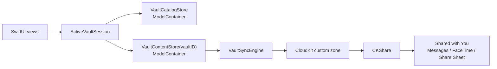
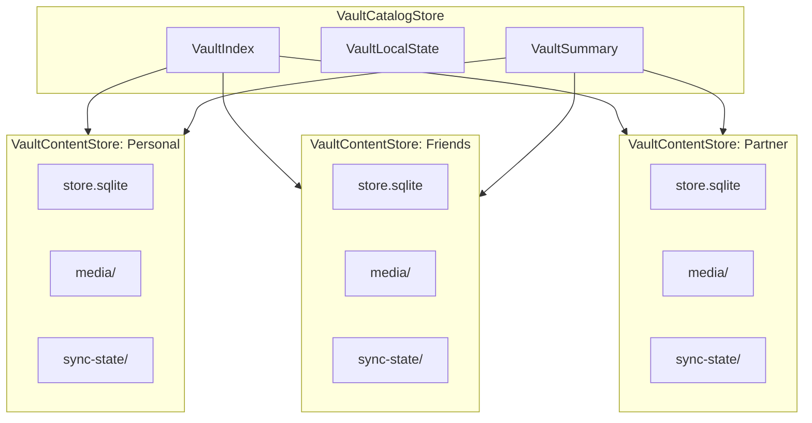
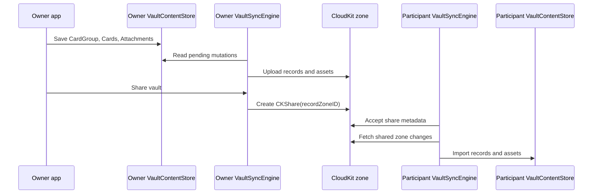
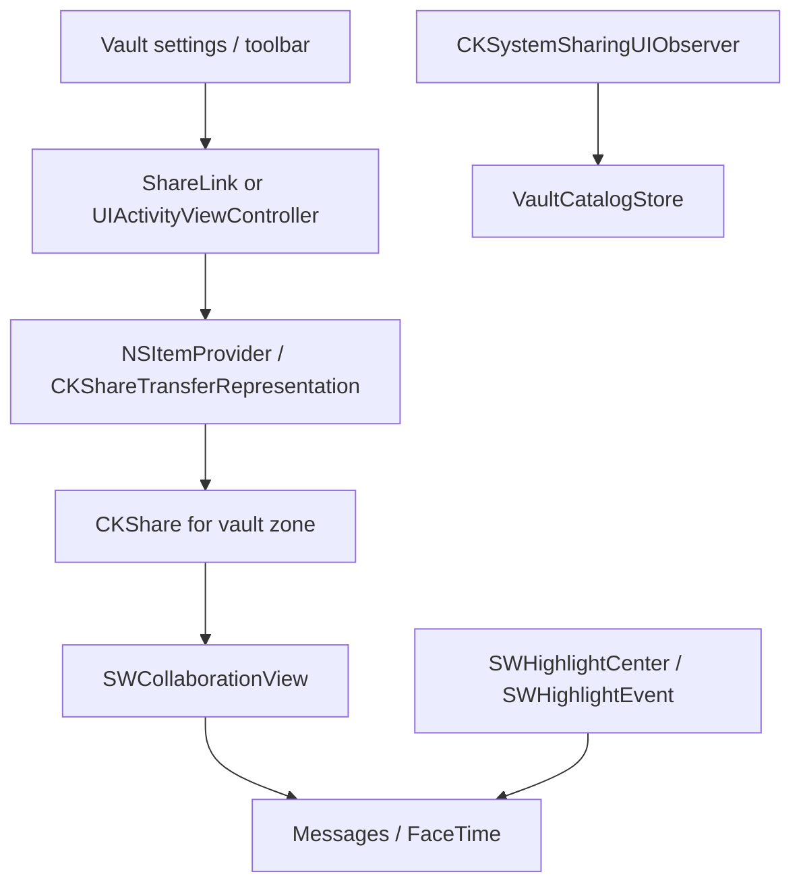
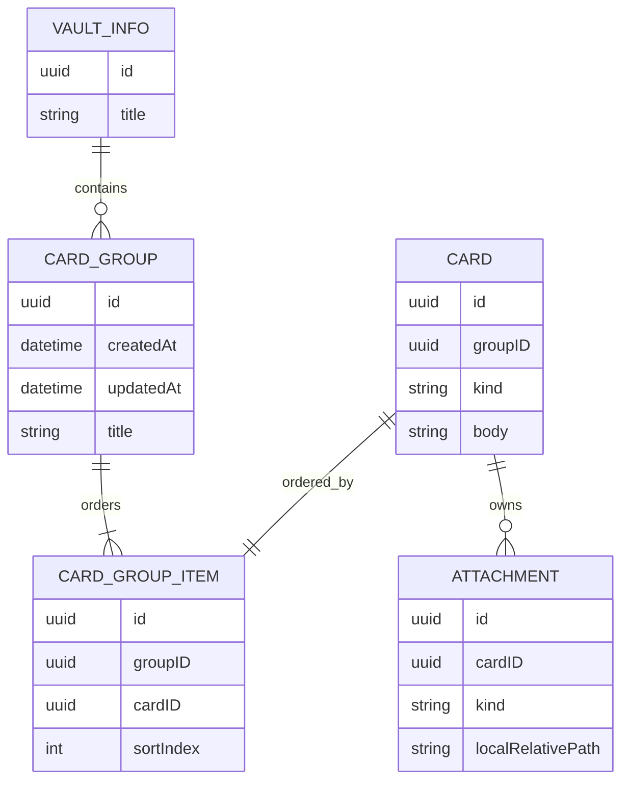

# Journal Vault Sync 設計

この文書は、Journal の永続化と collaboration の目標設計を記録するためのもの。
`SPECIFICATION.md` は現在のアプリ仕様を記述し、この文書はこれから作る
target architecture を扱う。

## 方向性

Journal では SwiftData の managed CloudKit mirroring を使わない。
SwiftData は local persistence と SwiftUI からの observation のための layer として扱う。

CloudKit collaboration はアプリ側の sync layer が所有する。
その layer が local SwiftData model と CloudKit record の対応付け、
`CKShare` の作成と受け入れ、remote change の import を担当する。

Shared with You は sync layer ではなく、Messages、FaceTime、share sheet、
system collaboration UI と接続する presentation / integration layer として使う。
Journal の data authority は CloudKit と `VaultSyncEngine` に置き、
Shared with You は「共有を Apple platform 上で collaboration として見せる」ために使う。

重要な境界は次の形になる。

```text
SwiftUI
  observes
SwiftData ModelContainer
  stores one local vault
VaultSyncEngine
  maps to and from
CloudKit zone / CKShare
Shared with You
  presents collaboration entry points
```



## Vault

Vault は durable な collaboration boundary。
アプリ内に複数作れるようにする。

- 完全個人用
- 友達と
- パートナーと

各 vault は local SQLite store と SwiftData `ModelContainer` を個別に持つ。
CloudKit 側では 1 vault が 1 custom record zone に対応する。
shared vault の場合は、その zone を他の iCloud user と共有する。
personal vault は特別な data model ではなく、まだ `CKShare` が作られていない vault として扱う。

```text
Journal/
  catalog.sqlite
  Vaults/
    <vault-id>/
      store.sqlite
      media/
      sync-state/
```

この分割により、削除、reset、export、invite acceptance、conflict recovery を
vault 単位に閉じ込められる。

## Store 分割

永続化は 2 段に分ける。

```text
VaultCatalogStore
  VaultIndex
  VaultLocalState
  VaultSummary

VaultContentStore(vaultID)
  VaultInfo
  CardGroup
  CardGroupItem
  Card
  Attachment
  SyncMetadata
  PendingMutation
```



`VaultCatalogStore` は小さな catalog store。
vault picker、launch routing、widget summary、local-only preference を支える。
card content は持たない。

`VaultContentStore` は 1 つの vault の card content を所有する store。
SwiftData model instance は別の vault container にまたがって持ち回らない。
vault 間で content を移動する場合、それは relationship の移動ではなく export/import として扱う。

以前話していた `JournalIndexStore` はここでいう `VaultCatalogStore`、
`VaultStore` はここでいう `VaultContentStore` に相当する。

## CloudKit Sync

Vault 用の store では SwiftData CloudKit mirroring を無効化する。

```swift
ModelConfiguration(
  schema: vaultSchema,
  url: vaultStoreURL,
  cloudKitDatabase: .none
)
```

custom sync layer は次を所有する。

- owned vault ごとの CloudKit zone 作成
- shared vault 用の `CKShare(recordZoneID:)` 作成
- share invitation の受け入れ
- owner 側の private database sync
- participant 側の shared database sync
- record system fields と change token
- pending upload / delete queue
- conflict policy
- asset upload / download
- read-only participant の permission handling

sync metadata は vault store の中に置く。
これにより、vault ごとの reset や repair を独立して実行できる。



## Shared with You / Messages 連携

Shared with You は、vault を Messages の会話や FaceTime の collaboration surface と結び付けるために使う。
CloudKit が data / permission / sync を担当し、Shared with You が share sheet、preview、
participant UI、Messages thread notice を担当する。



採用する API の役割は次の通り。

- `NSItemProvider.registerCKShare(...)` または `CKShareTransferRepresentation` で、
  vault の `CKShare` を collaboration object として share sheet に渡す。
- `UIActivityItemsConfiguration` / `LPLinkMetadata`、または SwiftUI の `SharePreview` で、
  Messages や share sheet に出る vault preview の title と image を提供する。
- `SWCollaborationView(itemProvider:)` を vault toolbar または vault settings に置き、
  participant 表示、`activeParticipantCount`、Manage Share UI への入口を提供する。
- `CKSystemSharingUIObserver` で、system sharing UI 経由の share save / stop sharing を observe し、
  `VaultCatalogStore` の share state を更新する。
- `SWHighlightCenter` と `SWHighlightEvent` 系を使い、必要に応じて Messages thread に
  content update、mention、rename/delete、membership update の notice を post する。

`CKSystemSharingUIObserver` は remote record changes の observer ではない。
他の participant が card を編集した、attachment が増えた、という変更は
`VaultSyncEngine` が CloudKit remote changes として取り込む。
`CKSystemSharingUIObserver` は local device 上の system sharing UI が `CKShare` を
save / delete した結果を local state に反映するためのもの。

`VaultCatalogStore` には Shared with You 用の summary state を持たせる。

```text
VaultSummary
  vaultID
  title
  isShared
  shareURL?
  shareRecordName?
  participantCount
  permissionSummary
  lastSharedWithYouNoticeAt?
```

最初に対応する範囲は、share sheet preview、`SWCollaborationView`、share save / stop sharing の反映まで。
Messages thread への update notice は、content edit の粒度と notification policy が固まってから入れる。

## CardGroup

`CardRelationship` のような任意の card-to-card graph は、core posting model には持ち込まない。
Journal で扱いたいものは、card 同士の複雑な接続ではなく、連続している authored sequence。

そのため、`CardGroup` が常に card の上位に存在する。

```text
CardGroup
  id
  createdAt
  updatedAt
  title?
  kind

CardGroupItem
  id
  groupID
  cardID
  sortIndex

Card
  id
  groupID
  kind
  body
  createdAt
  updatedAt
  location?

Attachment
  id
  cardID
  kind
  localRelativePath?
  metadata
```



概念としては `CardGroup` が ordered card IDs を持つ。
local store 上では、`CardGroup.orderedCardIDs` のような ordered value として表現してもよい。
ただし sync-friendly な default は `CardGroupItem`。
ordering の変更を通常の row mutation として扱えるため、大きな array field を毎回 mutate しなくて済む。

ルールは次の通り。

- すべての card は必ず 1 つの `CardGroup` に属する。
- single-card post も、card を 1 つだけ持つ `CardGroup` として表現する。
- thread-like post は、複数 card を authored order で持つ 1 つの `CardGroup` として表現する。
- cross-vault grouping は許可しない。
- cross-group reference は最初の collaboration design では scope 外にする。

この形にすると cycle detection が不要になる。
また widget の「最新 item」の意味も明確になる。
group 内の最新 authored item は最後に ordered された card、
最新 post は最も新しい group として扱える。

## Media

Row と media は同じ vault boundary に閉じる。
participant がある shared boundary から card row だけ受け取り、
media だけ別 boundary から待つ形にはしない。

Media は vault directory 配下の file として保存し、
`VaultSyncEngine` が CloudKit asset として同期する。
shared vault では、`Attachment` record と `CKAsset` が同じ shared zone に含まれる。
participant は shared database から record を受け取り、asset file を自分の local vault directory に保存する。

```text
VaultContentStore
  Attachment row
Vault directory
  media/<attachment-id>
CloudKit zone
  Attachment record + CKAsset
```

UI は引き続き row boundary で live SwiftData model を observe する。
attachment record が local file より先に届いた場合は、
sync layer が file availability の signal を明示的に発火し、
表示中の view が load を retry できるようにする。

## Widget と Global View

Vault は別々の `ModelContainer` に分かれるため、
すべての card を 1 つの `@Query` で横断する global query はできない。

その代わり、`VaultCatalogStore` に denormalized summary を持つ。

- vault ごとの latest group
- vault ごとの latest visible card
- unread / activity state
- vault display metadata

Widget はまず `VaultCatalogStore` を読む。
full card content が必要な場合は vault ID から該当する `VaultContentStore` を開ける。
ただし default path は小さな summary snapshot を読む形にする。

## 未決定事項

- sync actor は open 中の vault だけ alive にするか、全 vault に background sync engine を持たせるか。
- doodle JSON のような小さな authored data は SwiftData row に直接持つか、attachment asset として扱うか。
- text edit の最初の conflict policy をどうするか。field-wise last write wins、explicit version、append-only replacement のどれに寄せるか。
- `VaultCatalogStore` のうち、どこまでを user 自身の device 間で sync し、どこからを local-only にするか。
- Messages thread に post する Shared with You notice は、どの user action から始めるか。

## 最初の Spike

最小の useful spike は次の順番で作る。

1. Personal、Friends、Partner の 3 つの vault row を持つ `VaultCatalogStore` を作る。
2. vault ごとに separate vault store file を作る。
3. `CardGroup` と `Card` を作り、すべての save が group を生成するようにする。
4. vault store では SwiftData CloudKit mirroring を無効化する。
5. network なしの `VaultSyncEngine` protocol と logging stub を実装する。
6. active `ModelContainer` を差し替えて UI が vault を切り替えられることを確認する。

CloudKit zone 作成、`CKShare`、share acceptance は、この spike のあとに追加する。

## Collaboration Spike

CloudKit zone と `CKShare` が作れるようになった後、Shared with You 連携を次の順番で検証する。

1. vault の `CKShare` から collaboration item provider を作る。
2. share sheet に vault preview title / image を出す。
3. Messages に collaboration として送れることを確認する。
4. shared vault の settings または toolbar に `SWCollaborationView` を表示する。
5. `CKSystemSharingUIObserver` で share save / stop sharing を拾い、`VaultCatalogStore` を更新する。
6. owner / participant の permission と `participantCount` の見え方を確認する。
7. content edit notice を 1 種類だけ `SWHighlightChangeEvent` として post するか判断する。

## 参考

- [WWDC22: メッセージAppで共同制作の体験を強化する](https://developer.apple.com/jp/videos/play/wwdc2022/10095/)
- [Adding shared content collaboration to your app](https://developer.apple.com/documentation/sharedwithyou/adding-shared-content-collaboration-to-your-app)
- [SWCollaborationView](https://developer.apple.com/documentation/sharedwithyou/swcollaborationview)
- [CKSystemSharingUIObserver](https://developer.apple.com/documentation/cloudkit/cksystemsharinguiobserver)
