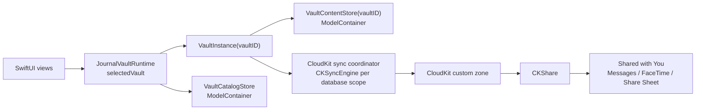
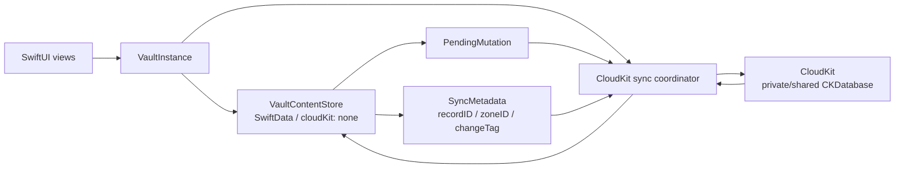
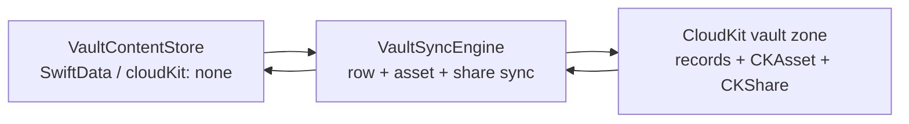
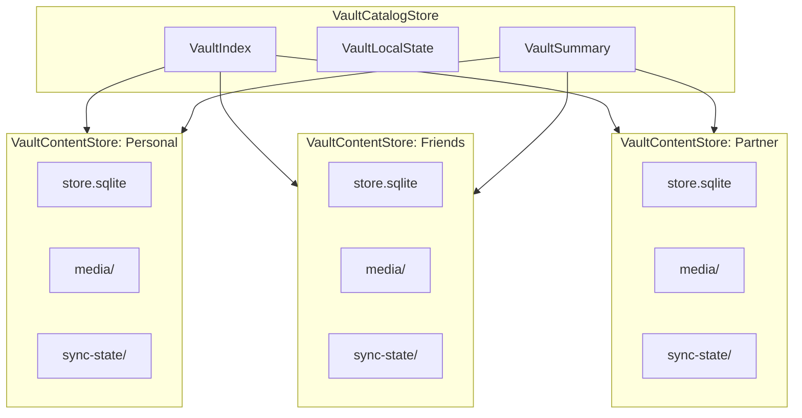
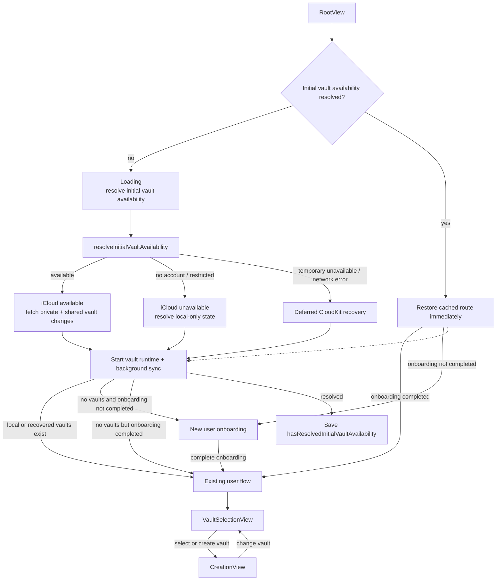
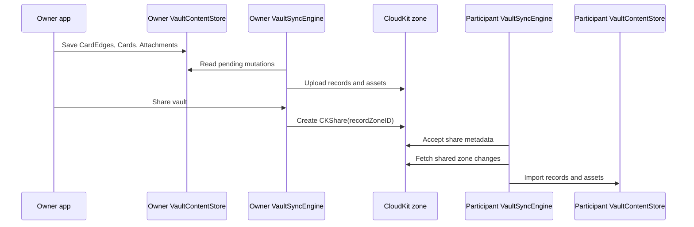
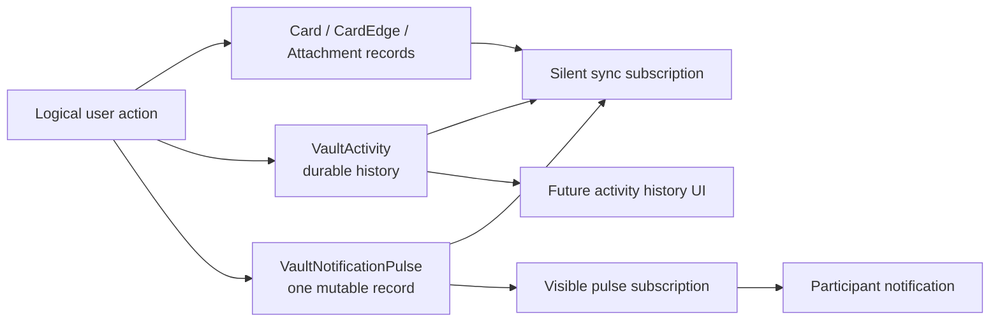
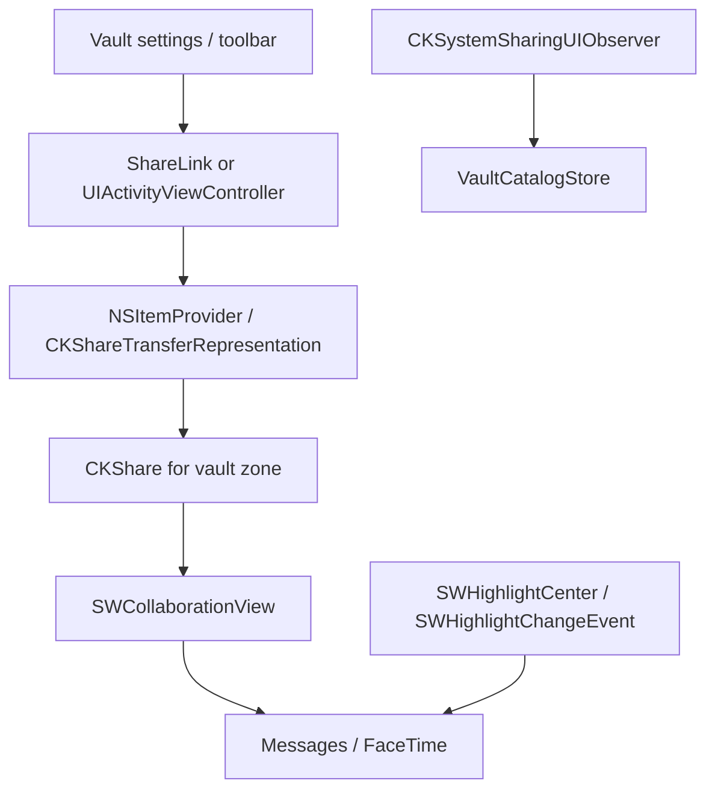
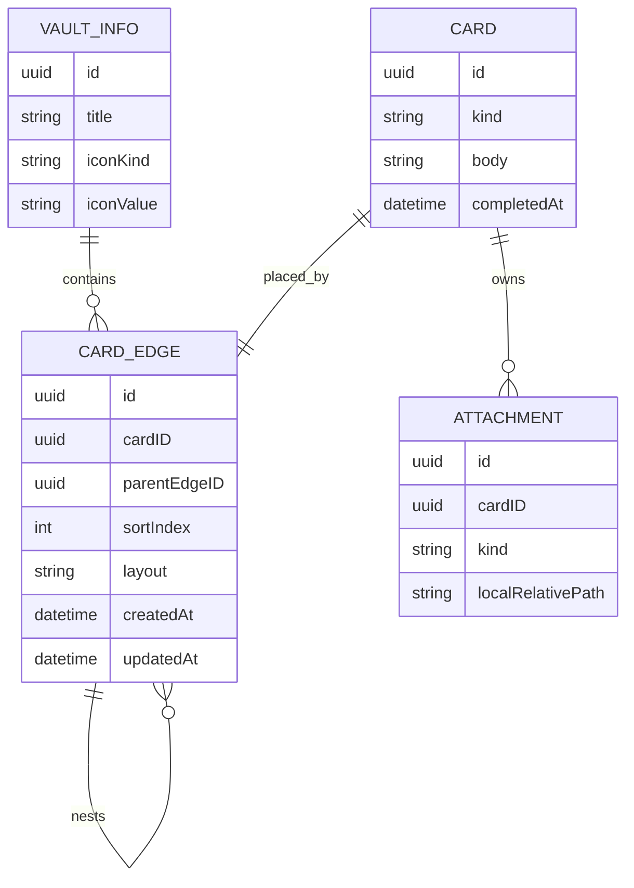
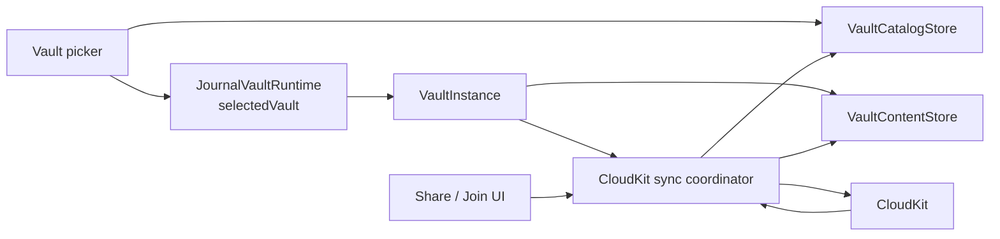

# Journal Vault Sync 設計

この文書は、Journal の永続化と collaboration の目標設計を記録するためのもの。
`SPECIFICATION.md` は現在のアプリ仕様を記述し、この文書はこれから作る
target architecture を扱う。

## 方向性

Journal では SwiftData の managed CloudKit mirroring を使わない。
SwiftData は local persistence と SwiftUI からの observation のための layer として扱う。

CloudKit collaboration はアプリ側の sync layer が所有する。
その layer が local SwiftData model と CloudKit record の対応付け、
`CKShare` の作成と受け入れ、remote change の import を担当する。

Shared with You は sync layer ではなく、Messages、FaceTime、share sheet、
system collaboration UI と接続する presentation / integration layer として使う。
Journal の data authority は CloudKit と `VaultSyncEngine` に置き、
Shared with You は「共有を Apple platform 上で collaboration として見せる」ために使う。

重要な境界は次の形になる。

```text
SwiftUI
  observes
VaultInstance
  owns one local vault database
CloudKit sync coordinator
  maps to and from
CloudKit zone / CKShare
Shared with You
  presents collaboration entry points
```



## 実装方針

この作り替えは UI rewrite ではなく、まず persistence / sync foundation の
作り替えとして進める。UI は新しい vault store と sync state が安定してから、
vault picker、toolbar、settings、collaboration view の順で調整する。

実装 task の管理は `VAULT_TASKS.md` で行う。ここでは architecture と境界を記述し、
どの task を誰がいつ触るか、並行作業の file ownership、Done 条件は task document に寄せる。

最初の milestone は次の 2 点に集中する。

1. SwiftData の CloudKit mirroring を vault store では完全に無効化する。
2. CloudKit との同期は `VaultSyncEngine` が所有する明示的な sync layer として作る。

app shell の user-facing save / read UI は `VaultInstance` を使う。
`VaultInstance` は 1 vault の local database、media directory、sync/outbox status、
permission/share state、vault-scoped action を UI に見せる domain object とする。
内部では `VaultContentStore` を所有するが、画面は CloudKit transport object を直接持たない。
旧 `JournalModel` store は app shell の startup path では開かない。
Journal はまだ pre-release なので legacy migration layer は保持せず、
SwiftUI tree に legacy `ModelContainer` も注入しない。
schema break で vault content store が開けない場合は、旧 rows を変換せず、
その vault の `store.sqlite*` と `media/` だけを reset して作り直す。
この時 CKSyncEngine state も reset し、次の fetch で CloudKit records / CKAssets
から fresh store を materialize する。catalog / sibling vault content store は
reset しない。
`cloudKitDatabase: .automatic` を前提にした model constraint、widget query、
media sync の分離設計は target architecture に順次移行する。



画面は CloudKit を直接読まない。
画面は SwiftData を local truth として observe し、`VaultSyncEngine` が
remote changes を import した結果として SwiftData が更新される。

`CKRecord` は local persistence ではなく transport shape として扱う。
local model 側には `CKRecord` を丸ごと保存するのではなく、
record ID、zone ID、change tag、encoded system fields など、再送信と
conflict resolution に必要な metadata を保持する。

## 既存 SyncEngine の扱い

旧 `MediaSyncEngine` は app shell から削除済みで、最終形には残さない。
その責務は `VaultSyncEngine` に吸収する。

旧 architecture では SwiftData CloudKit mirroring が `Card` / `Attachment` row を同期し、
`MediaSyncEngine` が attachment file / `CKAsset` を別 zone で補助同期している。
これは legacy architecture のための bridge だったため、app shell の save / list が
vault store へ移った時点で削除した。

target architecture では、vault store は `cloudKitDatabase: .none` で作り、
`VaultSyncEngine` が row、asset、zone、`CKShare`、subscription、remote change import を
vault boundary の中でまとめて扱う。shared vault でも row と media は同じ shared zone に
含めるため、participant が row だけを受け取り、media file だけ別 boundary から待つ形にしない。



`MediaSyncEngine` を消す条件として次の境界を置いた。

1. app shell の save / read が selected `VaultInstance` 経由で `VaultContentStore` を使う。
2. attachment row と media file が vault directory 配下に保存される。
3. asset upload / download と file availability signal が `VaultSyncEngine` 経由になる。
4. widget / global view が `VaultCatalogStore` の summary を読む。

`SyncStatusMonitor` も同じ境界で置き換える。
旧実装の SwiftData mirroring と `MediaSyncEngine` queue を監視する UI ではなく、
CloudKit sync coordinator と `VaultInstance` の upload / download / conflict / share state と
`VaultCatalogStore` の vault summary を見る UI にする。

2026-07 の app shell 移行では、1、2、3 を先に満たした。
`MediaSyncEngine` / `SyncStatusMonitor` / 旧 sync status UI は削除済み。
production runtime は `CloudKitVaultSyncEngine` を使う。`LoggingVaultSyncEngine` は
preview / debug / narrow tests 用の network-less stub として残す。
4 は widget migration の次フェーズで行う。

## Vault

Vault は durable な collaboration boundary。
アプリ内に複数作れるようにする。

- 完全個人用
- 友達と
- パートナーと

各 vault は local SQLite store と SwiftData `ModelContainer` を個別に持つ。
local persistence の意味では `Vault == store.sqlite == ModelContainer == VaultContentStore`。
CloudKit content boundary の意味では `Vault == custom record zone`。
shared vault の場合は、その zone を他の iCloud user と共有する。
CloudKit transport database の意味では `Vault != CKDatabase`。
owned vault は current user's private database の zone、participant として参加した vault は
current user's shared database から見える zone になる。
personal vault は特別な data model ではなく、まだ `CKShare` が作られていない vault として扱う。

```text
Journal/
  catalog.sqlite
  Vaults/
    <vault-id>/
      store.sqlite
      media/
      sync-state/
```

この分割により、削除、reset、export、invite acceptance、conflict recovery を
vault 単位に閉じ込められる。

## Store 分割

永続化は 2 段に分ける。

```text
VaultCatalogStore
  VaultIndex
  VaultLocalState
  VaultSummary

VaultContentStore(vaultID)
  VaultInfo
  VaultActivity
  VaultNotificationPulse
  CardEdge
  Card
  Attachment
  SyncMetadata
  PendingMutation
  PendingSharedWithYouNotice  # local only
```



`VaultCatalogStore` は小さな catalog store。
vault picker、launch routing、widget summary、local-only preference を支える。
card content は持たない。

`VaultContentStore` は 1 つの vault の card content を所有する store。
SwiftData model instance は別の vault container にまたがって持ち回らない。
vault 間で content を移動する場合、それは relationship の移動ではなく export/import として扱う。

`VaultInstance` は UI が触る vault の domain object。
1 つの `VaultContentStore`、foreground sync interest、outbox count、permission/share state、
vault-scoped actions を束ねる。`VaultInstanceRegistry` は process 内で vault ごとに
stable な `VaultInstance` を返し、`VaultStoreRegistry` はその内側で vault ごとに
単一の `ModelContainer` を保証する。

以前話していた `JournalIndexStore` はここでいう `VaultCatalogStore`、
`VaultStore` はここでいう `VaultContentStore` に相当する。

## CloudKit Sync

Vault 用の store では SwiftData CloudKit mirroring を無効化する。

```swift
ModelConfiguration(
  schema: vaultSchema,
  url: vaultStoreURL,
  cloudKitDatabase: .none
)
```

custom sync layer は次を所有する。

- owned vault ごとの CloudKit zone 作成
- shared vault 用の `CKShare(recordZoneID:)` 作成
- share invitation の受け入れ
- owner 側の private database sync
- participant 側の shared database sync
- record system fields と change token
- pending upload / delete queue
- conflict policy
- asset upload / download
- read-only participant の permission handling

sync metadata は vault store の中に置く。
これにより、vault ごとの reset や repair を独立して実行できる。

CloudKit sync coordinator は app lifetime の service として起動し、private database 用と
shared database 用の sync path を分ける。`CKSyncEngine` を採用する場合、
engine は vault ごとではなく CloudKit database scope ごとに持つ。
engine state はアプリが disk に永続化する。

起動時には毎回 CloudKit vault recovery / reconciliation を kick する。
これは重い migration ではなく、local catalog と CloudKit 上の visible vault zones を
照合する lightweight repair path。

1. private database の Journal vault zones を enumerate し、missing catalog row を
   owned vault として materialize する。
2. shared database の accepted shared zones を enumerate し、missing catalog row を
   participant vault として materialize する。
3. zone-wide share は `CKRecordZone.share` または `CKRecordNameZoneWideShare` の
   `CKShare` record fetch で再発見し、local summary を補正する。
4. materialize 後は `CKSyncEngine.fetchChanges(.all)` を kick して通常 import path に戻す。

この recovery は UI を block しない。iCloud account unavailable、network failure、
CloudKit server error は non-fatal として記録し、次回起動または手動 refresh で再試行する。
毎回 full record import / CKAsset download をやり直すのではなく、catalog 欠落と
engine state 欠落を self-heal するのが目的。

recovery 後も CloudKit 上に visible vault がなく、local catalog も空の場合は、
onboarding 未完了なら新規 user onboarding、onboarding 完了済みなら空の vault picker を表示する。
preset vault は自動作成しない。user が最初の vault を作った時点で local catalog row、
vault store、CloudKit outbox が作られる。

Root screen routing は、fresh install だけ blocking Loading から始める。
初回は `JournalVaultRuntime.resolveInitialVaultAvailability()` を待ち、
iCloud available なら private / shared database の初回 vault discovery を行う。
この blocking discovery は Journal vault zone と `VaultInfo` display metadata record までに限定し、
`Card` / `Attachment` / `AttachmentResource.file` の full import と `CKAsset` download は
resolved decision 後の background `CKSyncEngine.fetchChanges` に任せる。
iCloud no account / restricted では local-only state として resolution を完了し、
CloudKit を使っていない user を Loading に閉じ込めない。
iCloud temporarily unavailable、account status could not determine、network failure では
deferred CloudKit recovery として resolution を完了し、次回以降の background sync / recovery に任せる。
resolved decision 後に `hasResolvedInitialVaultAvailability` を保存する。
次回以降はこの cached decision と `hasCompletedOnboarding` から即座に route を復元し、
`JournalVaultRuntime.start()` / background CloudKit sync は毎回走らせる。
`hasCompletedOnboarding` は「vault が存在しない user に onboarding を再表示するか」を決める
補助 flag であり、既存 vault / recovered vault がある user を onboarding に戻す primary gate ではない。



subscription は画面ごとに作らない。
CloudKit subscription は sync layer が idempotent に作る durable infrastructure とし、
vault 画面を開くことは foreground sync interest として扱う。

```text
Vault screen opened
  -> VaultSyncCoordinator.activate(vaultID)
  -> fetchChanges / sendChanges を明示的に kick
  -> selected vault の asset download と conflict handling を優先
  -> imported changes が VaultContentStore に merge される
  -> SwiftUI が SwiftData observation で更新される
```

private database の owned vault では custom zone subscription を使える。
shared database の participant vault では record zone subscription を使えないため、
shared database subscription と change fetch のあとに zone ID で vault を振り分ける。



### Sync diagnostics probe

`CKSyncEngine` は import progress も backlog depth も公開しないため、local wipe 後の
vault は「まだ import 中」なのか「取り込むものがない」のか区別できない。sync boundary は
この判別のためだけに record 数を数える probe を持つ。

- `VaultSyncEngine.cloudRecordCounts(for:)` は対象 vault の zone を `CKSyncEngine` とは別の
  change token で列挙し、その token を捨てる。durable token と local store は一切触らない。
- 列挙は `desiredKeys: []` で行う。record type と件数しか必要としないため、media の多い
  vault でも asset を download しない。
- record type schema に依存する query は使わない。index 未 deploy の environment でも
  同じ結果が得られることを優先する。
- local 側は `VaultContentStore.localSyncCounts()` が record type ごとの row 数と outbox
  深さを返す。`cloudStorageEstimate()` と異なり payload ではなく row を数え、logically
  deleted row も含める。対応する CloudKit record がまだ存在し得るためである。
- probe は診断専用であり、sync の進行判断や retry 制御には使わない。

## Vault Activity / participant notification

この節を、Vault 内の activity history と participant-visible notification の
正規 contract とする。2026-08-18 時点で source code には `VaultActivity`、
`VaultNotificationPulse`、local-only `PendingSharedWithYouNotice`、CloudKit record
mapping、private/shared visible Pulse subscription、system notification presentation、
retention、および Shared with You delivery worker が実装されている。まだ release
ready を意味しない。CloudKit Development / Production の record type と `createdAt`
index の確認・deploy、Apple capability を含む App ID / provisioning profile、署名済み
実機二アカウント検証は repository 外の必須 gate である。

`VaultActivity` は CloudKit の raw record change log ではなく、user が意味を理解できる
logical action を表す immutable な domain event。1 回の user action が複数の `Card`、
`CardEdge`、`Attachment`、`AttachmentResource` record を変更しても、生成する activity は
最大 1 件とする。sync retry、conflict retry、import、retention cleanup のような
infrastructure action は activity を生成しない。

初期実装で確定する kind は `contentAdded` のみ。`createPost(cards:)` による新規投稿と
`appendCard(_:to:)` による Reply は、いずれも「Vault に content を追加した」という
1 回の logical action として扱う。root / Reply の違いを kind に重複して持たせず、
`subjectEdgeID` と `rootEdgeID` の topology から判定する。

- root 投稿: `subjectEdgeID == rootEdgeID`。Shared with You では `.edit` へ投影する。
- Reply: `subjectEdgeID != rootEdgeID`。Shared with You では `.comment` へ投影する。
- Home の multi-item drop は item ごとに partial success を返す既存 contract を維持し、
  成功した各 item を独立した logical action / Activity として扱う。

既存 content の edit、delete、vault metadata、membership などを activity にするかは
別の product decision とし、ここから推測して追加しない。



### Zone and persistence boundary

`VaultActivity` と `VaultNotificationPulse` は、対象 content と同じ Vault custom record
zone に置く。zone-wide `CKShare` の一部になるため、owner は private database、
participant は shared database から同じ records を参照する。

`VaultActivity` は履歴として `VaultContentStore` に import する domain row。
`VaultNotificationPulse` は notification transport 専用であり、履歴 UI の data source
にはしない。Activity は personal / shared を問わず全 Vault で作る。Pulse は書き込み直前に
`VaultDescriptor` から snapshot した delivery policy が「他の participant がいる」と判定した
場合だけ作る。その条件は participant vault、または owner vault で
`participantCount > 1` のいずれかとし、share UI の準備だけで `isShared == true` になった
owner-only vault は対象にしない。

content、Activity、条件を満たす場合の Pulse、および対応する `PendingMutation` は同じ
local transaction で commit する。Activity / Pulse の upload は content と同じ durable
outbox、retry、idempotency boundary で扱う。`VaultContentStore` 自身は catalog や share
state を読まず、app / extension の書き込み境界が明示的な delivery policy を渡す。

#### Delivery policy の freshness 限界

delivery policy は logical action と同じ local transaction に snapshot し、後から catalog を
refresh して既存 Activity を `historyOnly` から notification 対象へ昇格させない。share 作成や
participant 追加の後に過去の Activity を自動通知しないための local side-effect boundary である。

ただしこれは participant-at-action を server で証明する仕組みではない。`createdAt` は offline
作成も含む client 側の logical time である一方、`CKShare.modificationDate` と participant の
`dateAddedToShare` は CloudKit が share を save した server time である。両者を比較しても、特定の
Pulse save 時点の受信者 roster を確定できない。database subscription は recipient ごとの filter を
持たないため、share / participant の変更と offline outbox upload が交差した場合に、厳密に
「参加前の action は通知しない」を保証することはできない。

この初期 contract は snapshot cache による best effort とし、`isShared` だけへの後退はしない。
厳密な no-retroactivity が product requirement になった場合は、CloudKit commit 時刻を action 時刻に
再定義して server conditional write を設計するか、per-recipient delivery を持つ transport / backend を
別途導入する必要がある。

### `VaultActivity`

1 activity は作成後に内容を更新しない。retention cleanup だけが削除できる。
CloudKit record name には activity の UUID string を使う。

| Field | Type | Contract |
|-------|------|----------|
| `id` | `UUID` | Vault 内で一意。CloudKit record name と同じ値。 |
| `kindRawValue` | `String` | 初期値は `contentAdded`。未知の将来値は削除せず round-trip する。 |
| `subjectEdgeID` | `UUID?` | action が直接追加した placement。対象が既に消えていても activity 自体は残せる。 |
| `rootEdgeID` | `UUID?` | history / deep link が開く owning root。root 投稿では `subjectEdgeID` と同じ。 |
| `createdAt` | `Date` | offline 作成も含む logical action の発生時刻。 |

actor は custom display-name field として複製しない。CloudKit 上では record の
`creatorUserRecordID` を transport identity とし、local pending activity は current user
として扱う。participant name の解決や、解決できない場合の表示 copy は presentation
policy として別に決める。

Activity record に full Card body、thumbnail、`CKAsset` は複製しない。history surface は
subject record を解決し、解決できない場合は kind と時刻だけの fallback を表示できる
shape にする。Activity は security audit log、全変更の完全な archive、unread delivery
保証のいずれでもない。

### `VaultNotificationPulse`

visible push を `VaultActivity` 自体に直接 subscribe しない。`CKDatabaseSubscription` は
record creation、update、deletion のすべてに反応するため、Activity cleanup が
participant-visible notification を発生させてしまう。

代わりに、各 Vault zone に次の stable record を 1 件だけ置く。

| Field | Type | Contract |
|-------|------|----------|
| record name | `String` | `notification-pulse`。zone ごとに 1 件だけ。 |
| `latestActivityRecordName` | `String` | notification の契機になった `VaultActivity` record name。 |
| `kindRawValue` | `String` | notification routing 用。初期値は `contentAdded`。 |
| `updatedAt` | `Date` | save ごとに変わる pulse timestamp。 |

logical action が Activity を追加するたびに同じ Pulse record を上書きする。Pulse の
CloudKit conflict は server record を取り直して retry する。Activity が durable history
なので、同時更新で Pulse の最新値が上書きされても history は失われない。push 自体も
CloudKit / APNs により coalesce され得るため、Pulse は event delivery log ではなく
「Vault に新しい activity がある」という attention signal とする。

outbox は content、Activity、Pulse の順に record を提示する。ただし `CKSyncEngine` と
CloudKit は別 records の remote commit 順を保証しないため、Pulse が content より先に
観測される可能性は許容する。通知 tap は後述のとおり generic app open とし、起動後の
通常 sync が authoritative state を取得する。Pulse の `updatedAt` も concurrent writer の
local-wins retry により単調増加を保証できないため、未読 cursor や最新 Activity の authority
には使わない。

### Subscription ownership

subscription は sync layer が CloudKit account ごと、database scope ごとに idempotent に
管理する。silent sync と visible notification は次の stable ID で分離する。

```text
tinycurve.vault-sync.private.v1
tinycurve.vault-sync.shared.v1
tinycurve.vault-pulse.private.v1
tinycurve.vault-pulse.shared.v1
```

- `CKSyncEngine.Configuration.subscriptionID` に private / shared の sync ID を明示し、全 Vault
  record の同期 wake-up を担う silent subscription を Pulse 用 subscription から分離する。
  visible subscription より先にこの設定を入れ、`CKSyncEngine` が既存 database subscription
  を自動探索して Pulse 用 subscription を sync 用に採用しないようにする。
- 表示用には `recordType == VaultNotificationPulse` の `CKDatabaseSubscription` を
  private / shared database に別途作る。Activity cleanup はこの subscription の対象外。
- visible subscription の save は record sync を止めてはならない。CloudKit は同一 database への
  subscription 変更を 1 つの server operation に coalesce するため、`CKSyncEngine` が silent
  subscription を確立している最中に Pulse subscription を save すると、その失敗が engine 側の
  subscription ごと fetch を落とす。よって Pulse subscription の reconciliation は、その scope の
  engine が `didFetchChanges` を報告した後にだけ実行する。engine 再生成と account change では
  この待機状態に戻す。
- CloudKit が record type を作るのは record を save したときだけで、subscription の save は schema を
  作らない。`VaultNotificationPulse` record がまだ 1 件も upload されていない environment では
  save は必ず `unknownItem`（server 2003 `record type not found`）で失敗する。これは transport
  failure ではなく `schemaUnavailable` state として扱い、その scope の再試行を止める。Pulse record の
  save 成功（record type は database ではなく environment 単位なので両 scope を解除）または
  account change で再開する。
- visible notification info は stable な localization key
  `VAULT_ACTIVITY_NOTIFICATION_TITLE` / `VAULT_ACTIVITY_NOTIFICATION_BODY`、default sound、
  badge なし、`shouldSendContentAvailable == false` とする。初期 copy は title `Tinycurve`、
  body `There's an update in a shared Vault.` / `共有Vaultに更新があります。` とする。
- subscription は notification permission と独立して常設する。permission denial を理由に
  user-scoped subscription を削除せず、silent sync、Activity history、同じ account の別端末を
  無効にしない。
- notification は coalesce / omission され得るため、受信数と Activity 件数の一致を
  前提にしない。app を開いたら通常の change fetch で authoritative state を読む。
- Pulse や push payload に Card body / media を入れない。`CKDatabaseNotification` から
  record / zone ID を取得できる保証がないため、初期 notification tap は Tinycurve を通常起動
  するだけとし、特定 Vault / Card への推測 deep link は行わない。
- direct CloudKit visible notification は受信前に app code を挟めず zone predicate もない。
  初期設定は app-wide の system permission のみとし、Vault ごとの mute は提供しない。
  exact deep link または per-Vault mute が必須になった場合は provider push 等へ再設計する。

### System notification presentation and permission

silent push を fetch したあとに `UNNotificationRequest` を作る local reconstruction は行わない。
CloudKit の visible Pulse notification をそのまま system notification として表示する。
`TinycurveAppDelegate` は launch 完了前に `UNUserNotificationCenterDelegate` を設定し、Pulse 用
subscription ID の notification を foreground で受けた場合も `.banner`、`.list`、`.sound`
を返す。現在開いている Vault や scene state による app 独自の抑止は入れない。

system authorization は `[.alert, .sound]` を request し、badge は要求しない。初回 onboarding
では request せず、次の contextual boundary で app 内 primer を提示する。

- owner: system sharing UI が share を実際に save し、UI が dismiss した後。
- participant: share acceptance と initial shared-zone import が成功した後。
- existing user: `authorizationStatus == .notDetermined` で、participant vault または
  `participantCount > 1` の owner vault を初めて開いた後。

primer の「あとで」は system prompt を出さず、同じ install で自動再提示しない。
`.denied` では再 request せず Settings へ案内する。app が active に戻るたびに system settings
を再読込する。iOS は documented notification Settings URL を開く。macOS は private URL scheme
に依存せず System Settings を開き、`Notifications > Tinycurve` という手順を表示する。
native macOS Settings scene にも authorization state を明示的に注入する。

remote notification registration は authorization と独立して app launch で行い、alert を
denied / not determined にしても CloudKit silent sync transport を止めない。device token を独自
server へ送らない。registration failure は log して次の active 復帰で再試行し、unregister は行わない。
Shared with You notice はこの notification permission とは別の system integration である。

### Retention and cleanup

retention scope は Vault zone ごと。Activity は通常 append-only だが、無制限には残さない。

```text
retained target: 1,000 activities
cleanup high-water mark: 1,200 activities
cleanup result: delete oldest activities until 1,000 remain
```

新しい Activity の CloudKit upload を確認した実行 device が best-effort cleanup を schedule
する。`VaultActivity.createdAt` を Development / Production schema で queryable かつ
sortable にし、対象 zone の CloudKit query を authority として件数と oldest records を
決める。1,200 件以上なら newest 1,000 件を残し、古い records の delete を既存
`PendingMutation` outbox へ durable に積む。1 回の
CloudKit modify batch は最大 200 deletes とし、必要なら複数 batch で 1,000 件まで戻す。

cleanup failure は content save、Activity save、Pulse update の成功を取り消さない。次に
Activity を作る device が再試行できるため、server cron や特定 owner device は必要としない。

cleanup は次の contract に従う。

- oldest-first で bounded batch delete し、1 action ごとに 1 record を消し続けない。
- cleanup 自体は Activity を作らず、Pulse も更新しない。
- 複数 participant が同時に同じ古い record を消してもよい。既に削除済みの record は
  idempotent success として扱う。
- 不完全な local cache の件数だけを authority にして削除対象を選ばない。対象 zone の
  CloudKit query と `createdAt` sort で retained set を確定する。
- remote Activity deletion は通常の silent sync path で local history に反映する。

上限は storage bound であって unread guarantee ではない。長期間 offline の participant
が復帰する前に古い Activity が retention 対象になる可能性は許容する。将来 unread や
compliance archive が必要になった場合は、per-participant read cursor または別 archive
contract を設計し、この上限を暗黙に流用しない。

### Shared with You boundary

`VaultActivity` を Messages thread へ Shared with You notice を post する canonical logical
event として使う。ただし CloudKit Activity、visible push、`SWHighlightChangeEvent` は別々の責務。
origin device が作った Activity の CloudKit save 成功を sync layer が確認した後だけ、app
integration layer が share URL から `SWCollaborationHighlight` を解決して notice を post する。

initial mapping は `contentAdded` の topology から決める。

| Activity shape | `SWHighlightChangeEvent` trigger |
|----------------|----------------------------------|
| `subjectEdgeID == rootEdgeID` | `.edit` |
| `subjectEdgeID != rootEdgeID` | `.comment` |

remote Activity import、sync/conflict retry、retention cleanup は notice を post しない。short-lived
extension からの投稿でも origin-only boundary を失わないよう、local action transaction には
`PendingSharedWithYouNotice(activityID:)` を local-only row として残す。Activity upload の ack
後にだけ waiting から ready へ変更し、その durable transition を registry の ready-event stream
で vault ID として broadcast する。main app は event に加え launch / scene active ごとに全 Vault
を drain し、Share extension / App Intent 起点の ready row も回収する。

`SharedWithYouNoticeDeliveryCoordinator` は
`SWHighlightCenter.isSystemCollaborationSupportAvailable`、catalog の `shareURL`、
`getCollaborationHighlight(for:)` を順に確認する。system unsupported、share URL 不在、highlight
不在は terminal `skipped` とする。lookup の transient error だけ `attemptCount` /
`lastAttemptAt` を durable に更新して最大 3 回まで次の lifecycle boundary で retry し、同一
drain 内では繰り返さない。highlight 解決後は `attempted` を先に保存してから
`postNotice(for:)` するため、crash 時には重複より一件欠落を選ぶ at-most-once side effect となる。
terminal (`attempted` / `skipped`) row は bounded purge し、Activity retention が Activity を
delete する時も対応する local-only notice を同一 transaction で delete する。ready snapshot と
state update は vault transaction lock を共有し、snapshot 後に retention / remote delete が勝った
場合は `markAttempted == false` として post しない。失敗しても content、Activity、Pulse の成功を
戻さない。`SWHighlightCenter.postNotice` 自体には delivery acknowledgment がないため、Messages
notice は guaranteed delivery log ではない。

残る product decision:

- actor identity を participant-facing display name へどう解決するか。
- `contentAdded` 以外にどの logical action を Activity として残すか。
- Activity history UI をいつ、どの surface に置くか。

## Shared with You / Messages 連携

Shared with You は、vault を Messages の会話や FaceTime の collaboration surface と結び付けるために使う。
CloudKit が data / permission / sync を担当し、Shared with You が share sheet、preview、
participant UI、Messages thread notice を担当する。



採用する API の役割は次の通り。

- `NSItemProvider.registerCKShare(...)` または `CKShareTransferRepresentation` で、
  vault の `CKShare` を collaboration object として share sheet に渡す。
- `UIActivityItemsConfiguration` / `LPLinkMetadata`、または SwiftUI の `SharePreview` で、
  Messages や share sheet に出る vault preview の title と image を提供する。
- `SWCollaborationView(itemProvider:)` を vault toolbar または vault settings に置き、
  participant 表示、`activeParticipantCount`、Manage Share UI への入口を提供する。
- `CKSystemSharingUIObserver` で、system sharing UI 経由の share save / stop sharing を observe し、
  `VaultCatalogStore` の share state を更新する。
- `SWHighlightCenter` と `SWHighlightChangeEvent` を使い、必要に応じて Messages thread に
  content update、mention、rename/delete、membership update の notice を post する。

2026-08-18 時点の初回共有 UI は、runtime が保存済みにした zone-wide `CKShare` を
`NSItemProvider.registerCKShare(...)` で登録してから表示する。iOS は
`UIActivityItemsConfiguration` と `LPLinkMetadata` を持つ `UIActivityViewController`、native
macOS は `NSPreviewRepresentingActivityItem` を持つ `NSSharingServicePicker` を使う。既存 share
の participant 表示と管理は `SWCollaborationView` を維持する。app-lifetime の
`CKSystemSharingUIObserver` が system sharing UI 経由の save / stop を
`JournalVaultRuntime` の refresh / stop seam へ渡し、個々の view delegate は即時の UI feedback
だけを担う。

初回 owner invite からの notification primer は、system observer の成功 save、platform sharing
activity の成功、sheet dismissal の3条件を順不同で待つ。cancel / error は session を terminal に
して遅延 callback を無視し、3条件後も catalog を refresh して owner かつ
`participantCount > 1` を確認できたときだけ提示する。

Messages Collaboration と Shared with You の source entitlement contract は
`com.apple.developer.shared-with-you.collaboration = true` と
`com.apple.developer.shared-with-you = true` である。ただし capability の実効性は Apple
Developer の App ID、project entitlements、provisioning profile の3箇所で決まる。App ID で
capability を有効にし、profile を再生成した signed device build の effective entitlements を
検査するまで、Messages collaboration を Production-ready とは扱わない。

`CKSystemSharingUIObserver` は remote record changes の observer ではない。
他の participant が card を編集した、attachment が増えた、という変更は
`VaultSyncEngine` が CloudKit remote changes として取り込む。
`CKSystemSharingUIObserver` は local device 上の system sharing UI が `CKShare` を
save / delete した結果を local state に反映するためのもの。

`VaultCatalogStore` には Shared with You 用の summary state を持たせる。

```text
VaultSummary
  vaultID
  title
  isShared
  shareURL?
  shareRecordName?
  participantCount
  permissionSummary
  lastSharedWithYouNoticeAt?
```

最初の update notice は `VaultActivity.contentAdded` だけを対象にし、root 投稿を `.edit`、
Reply を `.comment` として post する。share sheet preview、`SWCollaborationView`、share save /
stop sharing の既存境界は維持する。将来の edit、delete、rename、membership notice は、対応する
Activity kind と product policy を決めてから追加する。

## Card Tree

`CardGroup` のような non-card root は、core posting model には持ち込まない。
Journal の content は、root も child も同じ shape の `CardEdge` として扱う。

GraphQL / Relay 的には、`CardEdge` が `node: Card` と edge metadata を持つ。
UI 上は `CardEdge { card, children }` の recursive tree として組み立てる。
永続化では `children` 配列を直接保存せず、`parentEdgeID` から導出する。

```text
Vault
  root CardEdge
    card
    children: [CardEdge]
  root CardEdge
    card
    children: [CardEdge]
```

target model では `CardRelationship` を廃止する。
post / continuation / latest item の意味は `CardEdge` で表現する。
linear sequence では root edge と child edge を `sortIndex` で並べる。
mind map の branch は `CardEdge.parentEdgeID` と layout metadata で表現する。
これにより、root だけ `CardGroup` になる不自然さを避けつつ、
任意 graph の merge、cycle 解決、relationship duplicate 解決を sync layer から外せる。

`Card` は本文と attachment を持つ content atom。
`CardEdge` はその card が vault tree 内のどこに置かれるかを表現する placement edge。
root card も child card も、必ず 1 つの `CardEdge` を通して表示される。

CloudKit には `CardEdge.parentEdgeID` を通常の field として保存する。
必要なら `CKRecord.Reference(action: .none)` にしてもよいが、sharing boundary のために
`CKRecord.parent` は使わない。
削除 cascade、subtree move、cycle validation、latest item の解釈は
CloudKit の record hierarchy ではなく domain rule として扱う。

entry 削除のlocal境界は `CardEdge.deletedAt` とする。選択したsubtreeの全edgeへ
同じtimestampを設定し、通常queryとlatest itemは `deletedAt == nil` のedgeだけを扱う。
このとき `Card` / `Attachment` / `AttachmentResource` rowとmedia fileはlocalに保持し、
SwiftUIが観測中のSwiftData modelをcontextからdetachしない。一方、同じtransactionで
subtreeのCloudKit record deleteを即時outboxへ積む。delete ackは
`PendingMutation`と`SyncMetadata`だけを削除する。

`deletedAt`はCloudKit fieldにしない。remote側ではrecordの存在／削除がsignalであり、
受信したCardEdgeまたはplaced Cardの削除をlocal logical deleteへ変換する。
同一fetch batchではCardEdge/Card tombstoneをAttachment/Resourceより先に適用する。
削除済みentry配下のpayload tombstoneはlocal row/fileを保持するが、entry削除を伴わない
edit replacementのAttachment/Resource tombstoneはobsolete dataを物理削除できる。
remote CardEdge recordが再作成された場合はlocal `deletedAt`をclearする。

将来「この card が別の card を参照している」「この card への reply を作る」のような
意味的な link が必要になった場合は、tree topology とは別の `CardLink` として追加する。
`CardEdge` は placement / ordering 用、`CardLink` は semantic cross-link 用として分ける。

```text
CardEdge
  id
  cardID
  parentEdgeID?
  sortIndex
  layout?
  createdAt
  updatedAt
  deletedAt?  # local only; never exported to CloudKit

Card
  id
  kind
  body
  completedAt?  # Todo only; nil means incomplete
  createdAt
  updatedAt
  location?

Attachment
  id
  cardID
  kind
  primaryResourceID
  thumbnail?
  metadata

AttachmentResource
  id
  attachmentID
  role
  byteSize
  contentType?
  pixelWidth?
  pixelHeight?
  duration?
  isHDR
  colorSpaceName?
  createdAt
```



概念としては Vault が root `CardEdge` の list を持つ。
root edge は `parentEdgeID == nil`。
child edge は同じ vault 内の parent edge を指す。
ordering、nesting、layout の変更を通常の edge row mutation として扱えるため、
大きな array field を毎回 mutate しなくて済む。

ルールは次の通り。

- すべての visible card は必ず 1 つの `CardEdge` から参照される。
- single-card post は、children を持たない root `CardEdge` として表現する。
- multi-card post は、root `CardEdge` と child edge の authored order で表現する。
- mind-map-like post は、`CardEdge.parentEdgeID` で tree を表現する。
- `CardEdge.parentEdgeID` は同じ vault 内の edge だけを指せる。
- cycle は許可しない。
- cross-vault tree は許可しない。
- cross-tree semantic reference は最初の collaboration design では scope 外にする。
- CloudKit の `CKRecord.parent` は hierarchy sharing 用には使わない。
  vault は zone-wide share なので、共有境界は custom zone が表現する。

この形にすると任意 graph の cycle detection は不要になる。
mind map の cycle validation は `parentEdgeID` の parent chain が同じ vault 内で
自分自身に戻らないことだけを確認すればよい。
また widget の「最新 item」の意味も sequence tree では明確になる。
sequence tree 内の最新 authored item は最後に ordered された edge、
最新 post は最も新しい root edge として扱える。
mind map tree の widget 表示は、root edge の card または tree summary を使う。

## Media

Row と media は同じ vault boundary に閉じる。
participant がある shared boundary から card row だけ受け取り、
media だけ別 boundary から待つ形にはしない。

Media は vault directory 配下の file として保存し、
`VaultSyncEngine` が CloudKit asset として同期する。
shared vault では、`Attachment` / `AttachmentResource` records と `CKAsset`
が同じ shared zone に含まれる。participant は shared database から record を受け取り、
asset file を自分の local vault directory に保存する。

```text
VaultContentStore
  Attachment row
  AttachmentResource row
Vault directory
  media/<resource-id>
CloudKit zone
  Attachment record
  AttachmentResource record + CKAsset
```

UI は引き続き row boundary で live SwiftData model を observe する。
attachment / resource record が local file より先に届いた場合は、
sync layer が file availability の signal を明示的に発火し、
表示中の view が load を retry できるようにする。

## Widget と Global View

Vault は別々の `ModelContainer` に分かれるため、
すべての card を 1 つの `@Query` で横断する global query はできない。

その代わり、`VaultCatalogStore` に denormalized summary を持つ。

- vault ごとの latest root edge / tree
- vault ごとの latest visible card
- unread / activity state
- vault display metadata

Widget はまず `VaultCatalogStore` を読む。
full card content が必要な場合は vault ID から該当する `VaultContentStore` を開ける。
2026-07 時点の widget first pass は `WidgetConfigurationIntent` で vault を選ばせ、
選択された `VaultContentStore` から latest visible card snapshot を直接作る。
この snapshot は photo では attachment thumbnail bytes を表示源にして、
Widget timeline で original-size image file を読まない。
text/link は本文、doodle / Bauhaus は authored JSON を decode した value を
Widget の SwiftUI view が描画する。
Todo は本文とoptional `completedAt`から作るread-only snapshotを描画し、
完了操作はapp側の`VaultContentStore` mutationに限定する。
audio と Lock Screen accessory family は constrained surface として typed label /
symbol を使う。
将来の default path は小さな summary snapshot を読む形に最適化する。

## 未決定事項

- doodle JSON のような小さな authored data は SwiftData row に直接持つか、attachment asset として扱うか。
- text edit の最初の conflict policy をどうするか。field-wise last write wins、explicit version、append-only replacement のどれに寄せるか。
- `VaultCatalogStore` のうち、どこまでを user 自身の device 間で sync し、どこからを local-only にするか。
- Vault Activity の未決定範囲は「Vault Activity / participant notification」節に集約する。

## 最初の Spike

最小の useful spike は UI の完成ではなく、SwiftData cloudKit off と sync layer の
境界を確実に作ることを目的にする。

Phase 1: Local vault foundation

1. 空の `VaultCatalogStore` を作り、user action で vault row を作れるようにする。
2. vault ごとに separate vault store file を作る。
3. vault store では SwiftData CloudKit mirroring を無効化する。
4. `SyncMetadata` と `PendingMutation` を vault store に置く。
5. network なしの `VaultSyncEngine` protocol と logging stub を実装する。
6. local write が `PendingMutation` に積まれることを確認する。

Phase 2: Content model

1. `CardEdge` と `Card` を作り、すべての save が root edge を生成するようにする。
2. `CardRelationship` の continuation 用途を `CardEdge.parentEdgeID` と `sortIndex` に置き換える。
3. attachment row と media file を vault directory 配下へ移す。
4. active `ModelContainer` を差し替えて UI が vault を切り替えられることを確認する。

Phase 3: CloudKit transport

1. owned vault ごとに custom record zone を作る。
2. `PendingMutation` から `CKRecord` を作って private database に送る。
3. remote changes を fetch して `VaultContentStore` に import する。
4. `AttachmentResource` record の `CKAsset` を attachment row と同じ vault zone で upload / download する。

Phase 4: Vault lifecycle UI

foundation が固まった後、UI は vault lifecycle を操作する surface として作る。
画面は CloudKit object を直接所有せず、`VaultCatalogStore` の state と
`VaultSyncCoordinator` の action を通して操作する。

1. Vault を切り替える。
   - vault picker / sidebar / menu は `VaultCatalogStore` の `VaultSummary` を読む。
   - 選択された vault は `JournalVaultRuntime.selectedVault` が `VaultInstance` として保持する。
   - `VaultInstance` は `VaultContentStore(vaultID)` を所有し、UI は instance 経由で read/write する。
   - vault を開いたら `VaultInstance.activateForeground()` を呼び、foreground fetch と asset download を優先する。
2. Vault を作る。
   - local catalog row、vault directory、vault content store を作る。
   - 初期状態は unshared vault とし、CloudKit zone と `CKShare` は必要になったタイミングで作る。
   - app install 時に preset vault は作らない。recovery 後に local / remote vault が
     0 件なら、新規 user として空の picker を出す。
3. Vault に招待する。
   - owner 権限の vault だけ invite action を出す。
   - sync layer が vault zone と最小 record を CloudKit に確保し、`CKShare(recordZoneID:)` を作る。
   - share sheet / Shared with You に渡す preview title、image、permission options は vault summary から作る。
   - share save / stop sharing は catalog の share state に反映する。
4. Vault に参加する。
   - app / scene delegate が `CKShare.Metadata` を受け取る。
   - sync layer が share を accept し、shared database の zone view を local catalog row に materialize する。
   - 初回 import が終わったら、その vault を `VaultInstance` として開ける。
   - read-only participant では compose / edit / delete UI を permission state で制限する。



CloudKit zone 作成と owned vault の invite issuance は UI action として接続済み。
`VaultSelectionView` の owned vault row から `VaultSyncEngine.prepareShare(for:)` を呼び、
`CloudKitVaultSyncEngine` が private database の custom zone を保存し、
pending outbox を一度 `CKSyncEngine` へ流したうえで
`CKRecordNameZoneWideShare` を fetch する。既存 share がなければ
`CKShare(recordZoneID:)` を作成して保存し、saved `CKShare` と `CKContainer` を
`NSItemProvider.registerCKShare(...)` に渡す。初期 owner invite は iOS の
`UIActivityItemsConfiguration` / `LPLinkMetadata` activity と native macOS の
`NSSharingServicePicker` preview で提示する。初期 UI は private invite と read-write
permission に絞り、public link はまだ出さない。

Invite acceptance は SwiftUI app に UIKit scene delegate を差し込み、
running-scene callback と cold-launch `UIScene.ConnectionOptions.cloudKitShareMetadata`
の両方から `CKShare.Metadata` を `JournalVaultRuntime.acceptShare(metadata:)` に渡す。
runtime は `VaultSyncEngine.acceptShare(metadata:)` を通じて share を accept し、
shared database の `CKSyncEngine` に accepted zone 優先の fetch をかける。
fetched zone は既存の shared-zone materialization/import path で local catalog と
vault store に反映される。実 iCloud の二アカウント手動検証はまだ残っている。

Shared with You collaboration preview、app-lifetime sharing observer、root `.edit` / Reply
`.comment` update notice の source implementation は接続済みである。CloudKit schema/index deployment、
effective entitlement を含む signed-device build、Messages で作られた highlight を使う二アカウント
実機検証は別の external release gate として残る。

## Collaboration device verification

source implementation を release 可能と確認するには、実機で Shared with You 連携を次の順番で
検証する。

1. vault の `CKShare` から collaboration item provider を作る。
2. share sheet に vault preview title / image を出す。
3. Messages に collaboration として送れることを確認する。
4. shared vault の settings または toolbar に `SWCollaborationView` を表示する。
5. `CKSystemSharingUIObserver` で share save / stop sharing を拾い、`VaultCatalogStore` を更新する。
6. owner / participant の permission と `participantCount` の見え方を確認する。
7. root post の `.edit` と Reply の `.comment` notice が、origin device の Activity save ack 後だけ
   post されることを確認する。remote import、retry、retention は post してはならない。

## 実装状況

2026-07 時点。実装は `Sources/JournalVault/`(dynamic framework、
`Tests/JournalVaultTests/` にユニットテスト)。app shell は
`JournalVaultRuntime` / `VaultInstance` を起動し、
Debug-only Settings から catalog、selected vault、outbox depth、debug write を確認できる。
Owned vault invite issuance is implemented through
`VaultSyncEngine.prepareShare(for:)` and `VaultSelectionView`'s system sharing UI
bridge. Invite acceptance is implemented through the scene metadata router,
`JournalVaultRuntime.acceptShare(metadata:)`, and the shared-database
`CloudKitVaultSyncEngine` import path; live two-account acceptance verification
is still pending. Vault deletion is implemented from `VaultSelectionView`:
owned vaults delete their private custom zone before local cleanup, participant
vaults target the accepted shared zone before removing local catalog/content
files. Shared with You surfacing is connected in source; signed two-account
device verification remains a release gate.

起動時には sync engine を start し、毎回 CloudKit vault recovery / reconciliation を
kick する。remote/private/shared vault が見つからず local catalog も空の場合は
新規 user 状態として扱い、空の vault picker を表示する。
app shell は旧 `JournalModel` App Group SQLite を startup path で開かない。
legacy local `JournalModel` module は project から削除済み。Journal は pre-release
なので product migration code は持たず、現在の schema を source of truth とする。
ユーザーが `VaultSelectionView` で vault を選んだ時点で
`JournalVaultRuntime.selectVault(_:)` が `VaultInstance` を開き、
`CreationView` と `SavedListView` はその selected instance だけを使う。

user-facing save は `CreationView` から `VaultInstance.createPost(cards:)` に書く。
user-facing edit は `SavedListView` から selected `VaultInstance` の
`VaultContentStore.updateCard(cardID:with:)` に書く。
Todoの完了／再開は`VaultContentStore.setTodoCompletion(cardID:isCompleted:)`に書き、
`completedAt`、`updatedAt`、Card save outboxを同一transactionで更新する。
user-facing list は selected `VaultInstance` の SwiftData `ModelContainer` を
environment に入れ、active `CardEdge` (`deletedAt == nil`) の `@Query` から `Card` / `Attachment` /
`AttachmentResource` relationship を辿る。
旧 saved-entry edit / export share UI、旧 sync status UI、`MediaSyncEngine`、
`SyncStatusMonitor` は削除済み。share / edit は vault-backed UI として作り直す。

実装済み:

- `VaultStoreLayout` — App Group 配下 `Journal/` の directory layout。
- `VaultCatalogStore` + `VaultIndex` / `VaultLocalState` / `VaultSummary`
  (cloudKitDatabase: .none、user-created vault、remote vault の materialize)。
- `VaultContentStore(vaultID)` + `VaultInfo` / `Card` / `CardEdge` /
  `Attachment` / `AttachmentResource` / `SyncMetadata` / `PendingMutation`。
  すべての write は同一 transaction で outbox(`PendingMutation`)を積む。
  save は必ず root `CardEdge` を作る。card edit は `Card` save と attachment replacement を
  同一 transaction で扱う。Todoは`Card.body`に本文、optional `Card.completedAt`に
  完了時刻を持ち、Boolは保存しない。完了／再開は本文を変更せず、既に同じ状態なら
  outboxを追加しない。`CardEdge` / `Attachment` / `AttachmentResource` は
  SwiftData relationship を主接続として持ち、record の out-of-order import を
  repair できるよう reference ID も横に保持する。entry削除は`CardEdge.deletedAt`による
  local logical deleteと即時CloudKit tombstone enqueueを同一transactionで行い、
  content row/media fileはlocalに保持する。
- `VaultStoreRegistry` — process 内で vault ごとに単一 `ModelContainer` を保証し、
  local mutation を `AsyncStream<VaultID>` で sync layer へ流す。
- `VaultInstanceRegistry` / `VaultInstance` — process 内で vault ごとに stable な
  UI-facing domain object を返す。`VaultInstance` は `VaultContentStore`、
  foreground sync interest、outbox count、将来の permission/share state、
  vault-scoped actions を束ねる。
- `VaultSyncEngine` protocol + `LoggingVaultSyncEngine`(network なしの stub)。
- `CloudKitVaultSyncEngine` — `CKSyncEngine` を private / shared database で
  1 つずつ所有。zone 名に vault ID を埋め込み、fetched changes を zone 名で
  vault へ routing。未知 zone は catalog へ materialize。zone は最初の save が
  `zoneNotFound` を返したときに lazy に作成。engine state は
  `SyncState/{private,shared}-database.json` に永続化。
  `AttachmentResource` の `CKAsset` upload / download(vault の `media/` に保存、
  file 到着時は `AttachmentResource.localFileRevision` を更新して SwiftData
  observation で UI preview を再読み込み)。
- `CKSyncEngine` state file は raw serialization ではなく versioned envelope として保存する。
  envelope は `formatVersion`、`schemaCompatibilityGeneration`、sorted
  `knownRecordTypes`、nested serialization を持つ。legacy raw file、decode failure、format /
  generation / type manifest の不一致は token を再利用せず、current empty envelope を先に保存して
  1 回の full refetch を開始する。empty marker は process が次の state update より前に終了しても
  同じ incompatible file を無限に invalidation しないためのもの。新 record type の materialization、
  remote collision policy、既存 record shape の compatibility を変える場合は
  `syncStateCompatibilityGeneration` を bump する。これは vault content / durable outbox を reset
  しない。旧 build が envelope を読めず raw state を書き戻した場合も、次の新 build が legacy として
  再 fetch する。
  account user ID hash はこの envelope には入れない。account change は既存
  `CKSyncEngine.Event.accountChange` handling で retention generation を invalidate し、進行中 cleanup
  を cancel して subscription reconciliation を再要求する。account をまたぐ local vault data の保持
  policy はこの token compatibility contract とは別の product decision とする。
- `JournalVaultRuntime` — `TinycurveApp` 起動時に
  App Group layout、catalog store、store registry、`CloudKitVaultSyncEngine` を作る。
  preset vault は自動作成しない。`previewRuntime()` と debug 用 factory は
  `LoggingVaultSyncEngine` を使い、CloudKit に触らず local vault store を検証できる。
  product UI の selected `VaultInstance` は `VaultSelectionView` の選択で開く。
  Settings の Debug-only `Vault Runtime` 画面から refresh、vault 切り替え、
  debug text card write を実行できる。
- `CreationView` / `SavedListView` — UI は selected `VaultInstance` だけを使う。
  legacy `ModelContainer` は SwiftUI environment に存在しない。

暫定判断(コード側にも記載):

- conflict policy は record 単位で local-pending-wins。
  server の system fields だけ採用して再送する。Todo本文と完了状態も同じCard record
  なので、同時変更のfield-wise mergeは行わない。
- remote の record deletion は local edit より優先。CardEdgeまたはplaced Cardの削除は
  local subtreeを論理削除し、payload row/fileは保持する。entry削除を伴わない
  Attachment/Resource削除はedit replacementとして物理cleanupできる。
- zone-level deletion(owner の削除 / share revoke / participant 側の removal)は
  catalog row と vault-local content directory を削除し、次回 picker refresh で消える。

source 実装済み（external release gate は別）:

- `VaultActivity` / `VaultNotificationPulse`、private/shared participant-visible Pulse subscription、
  foreground system UI、1,200 -> 1,000 件の opportunistic Activity retention cleanup。
- origin-only、ack-gated Shared with You update notice delivery と local-only notice retention。

未実装(次フェーズ):

- entry Trash UI、restore、retention、physical purge。
- Activity history を閲覧する product UI。
- `VaultSummary` の latest card denormalize。
- vault-backed saved-entry export share UI。

external release gate:

- Activity `createdAt` index と Activity / Pulse record type を CloudKit Development で確認し、
  Production へ deploy する。
- Shared with You / Messages Collaboration capability を App ID で有効化し、profile を再生成して
  signed device の effective entitlement を確認する。
- owner / participant 二アカウント実機で visible push、foreground banner/list/sound、share URL / highlight、
  ack-gated `.edit` / `.comment` notice を確認する。

## 参考

- [WWDC22: メッセージAppで共同制作の体験を強化する](https://developer.apple.com/jp/videos/play/wwdc2022/10095/)
- [Adding shared content collaboration to your app](https://developer.apple.com/documentation/sharedwithyou/adding-shared-content-collaboration-to-your-app)
- [SWCollaborationView](https://developer.apple.com/documentation/sharedwithyou/swcollaborationview)
- [CKSystemSharingUIObserver](https://developer.apple.com/documentation/cloudkit/cksystemsharinguiobserver)
- [CKDatabaseSubscription](https://developer.apple.com/documentation/cloudkit/ckdatabasesubscription)
- [CKQuerySubscription](https://developer.apple.com/documentation/cloudkit/ckquerysubscription)
