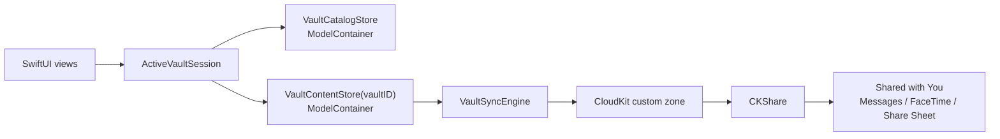
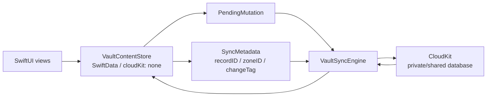
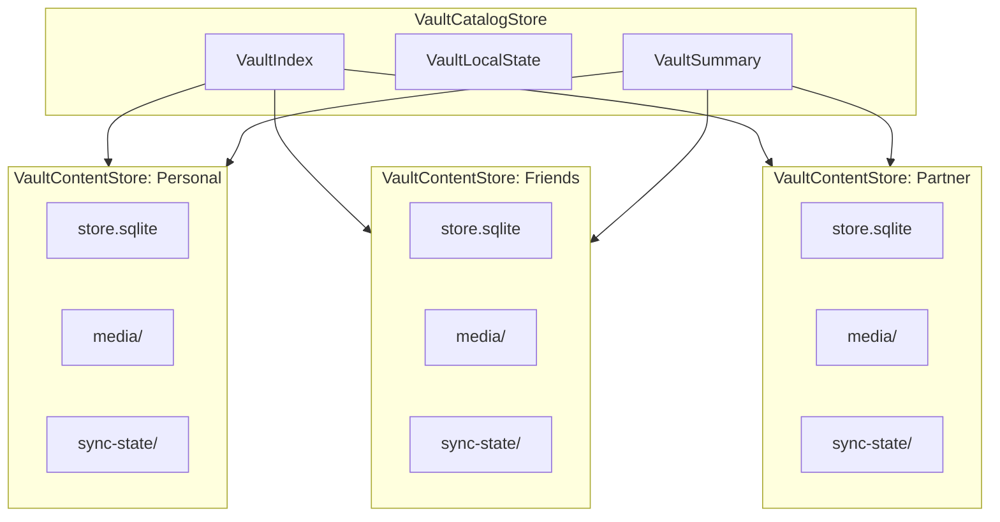
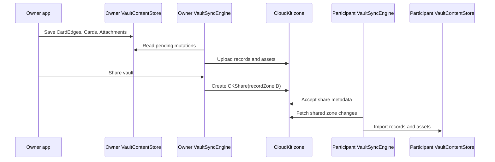
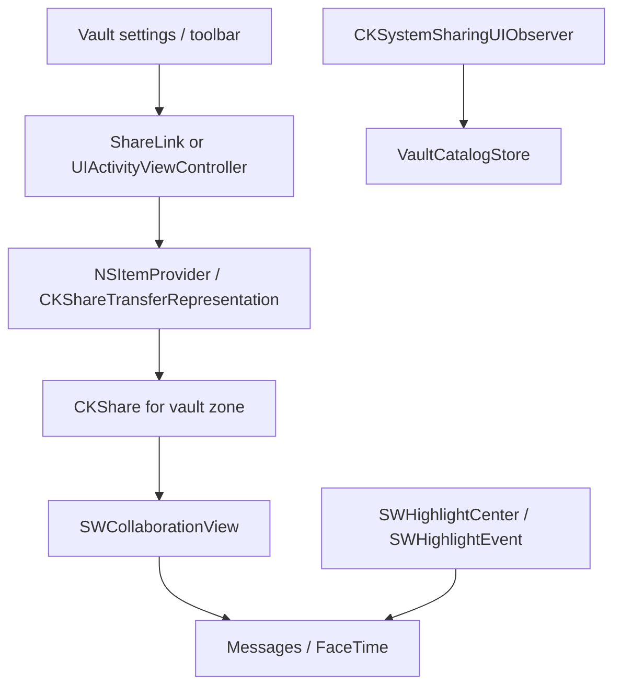
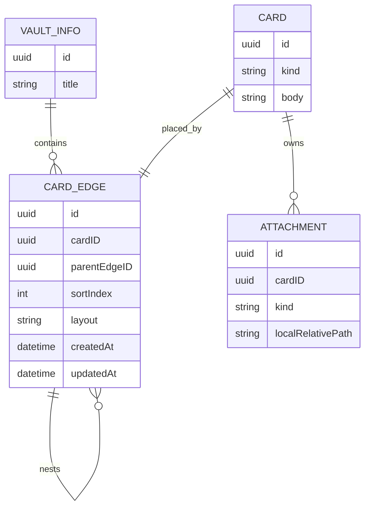
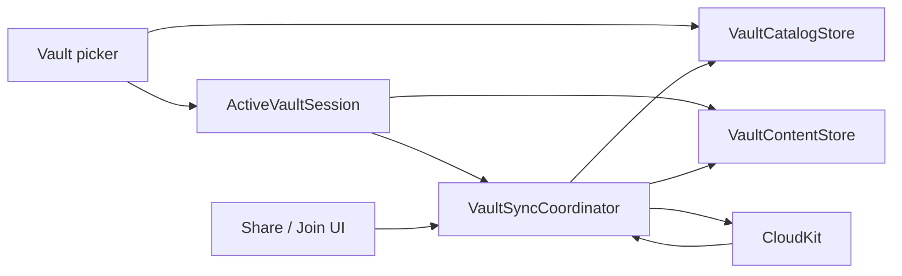

# Journal Vault Sync 設計

この文書は、Journal の永続化と collaboration の目標設計を記録するためのもの。
`SPECIFICATION.md` は現在のアプリ仕様を記述し、この文書はこれから作る
target architecture を扱う。

## 方向性

Journal では SwiftData の managed CloudKit mirroring を使わない。
SwiftData は local persistence と SwiftUI からの observation のための layer として扱う。

CloudKit collaboration はアプリ側の sync layer が所有する。
その layer が local SwiftData model と CloudKit record の対応付け、
`CKShare` の作成と受け入れ、remote change の import を担当する。

Shared with You は sync layer ではなく、Messages、FaceTime、share sheet、
system collaboration UI と接続する presentation / integration layer として使う。
Journal の data authority は CloudKit と `VaultSyncEngine` に置き、
Shared with You は「共有を Apple platform 上で collaboration として見せる」ために使う。

重要な境界は次の形になる。

```text
SwiftUI
  observes
SwiftData ModelContainer
  stores one local vault
VaultSyncEngine
  maps to and from
CloudKit zone / CKShare
Shared with You
  presents collaboration entry points
```



## 実装方針

この作り替えは UI rewrite ではなく、まず persistence / sync foundation の
作り替えとして進める。UI は新しい vault store と sync state が安定してから、
vault picker、toolbar、settings、collaboration view の順で調整する。

最初の milestone は次の 2 点に集中する。

1. SwiftData の CloudKit mirroring を vault store では完全に無効化する。
2. CloudKit との同期は `VaultSyncEngine` が所有する明示的な sync layer として作る。

既存の app shell は一時的に current store を読み続けてもよいが、
新しく作る vault store API は最初から `cloudKitDatabase: .none` にする。
`cloudKitDatabase: .automatic` を前提にした model constraint、widget query、
media sync の分離設計は順次 target architecture に移行する。



画面は CloudKit を直接読まない。
画面は SwiftData を local truth として observe し、`VaultSyncEngine` が
remote changes を import した結果として SwiftData が更新される。

`CKRecord` は local persistence ではなく transport shape として扱う。
local model 側には `CKRecord` を丸ごと保存するのではなく、
record ID、zone ID、change tag、encoded system fields など、再送信と
conflict resolution に必要な metadata を保持する。

## Vault

Vault は durable な collaboration boundary。
アプリ内に複数作れるようにする。

- 完全個人用
- 友達と
- パートナーと

各 vault は local SQLite store と SwiftData `ModelContainer` を個別に持つ。
CloudKit 側では 1 vault が 1 custom record zone に対応する。
shared vault の場合は、その zone を他の iCloud user と共有する。
personal vault は特別な data model ではなく、まだ `CKShare` が作られていない vault として扱う。

```text
Journal/
  catalog.sqlite
  Vaults/
    <vault-id>/
      store.sqlite
      media/
      sync-state/
```

この分割により、削除、reset、export、invite acceptance、conflict recovery を
vault 単位に閉じ込められる。

## Store 分割

永続化は 2 段に分ける。

```text
VaultCatalogStore
  VaultIndex
  VaultLocalState
  VaultSummary

VaultContentStore(vaultID)
  VaultInfo
  CardEdge
  Card
  Attachment
  SyncMetadata
  PendingMutation
```



`VaultCatalogStore` は小さな catalog store。
vault picker、launch routing、widget summary、local-only preference を支える。
card content は持たない。

`VaultContentStore` は 1 つの vault の card content を所有する store。
SwiftData model instance は別の vault container にまたがって持ち回らない。
vault 間で content を移動する場合、それは relationship の移動ではなく export/import として扱う。

以前話していた `JournalIndexStore` はここでいう `VaultCatalogStore`、
`VaultStore` はここでいう `VaultContentStore` に相当する。

## CloudKit Sync

Vault 用の store では SwiftData CloudKit mirroring を無効化する。

```swift
ModelConfiguration(
  schema: vaultSchema,
  url: vaultStoreURL,
  cloudKitDatabase: .none
)
```

custom sync layer は次を所有する。

- owned vault ごとの CloudKit zone 作成
- shared vault 用の `CKShare(recordZoneID:)` 作成
- share invitation の受け入れ
- owner 側の private database sync
- participant 側の shared database sync
- record system fields と change token
- pending upload / delete queue
- conflict policy
- asset upload / download
- read-only participant の permission handling

sync metadata は vault store の中に置く。
これにより、vault ごとの reset や repair を独立して実行できる。

`VaultSyncEngine` は app lifetime の service として起動し、private database 用と
shared database 用の sync path を分ける。`CKSyncEngine` を採用する場合も、
engine state はアプリが disk に永続化する。

subscription は画面ごとに作らない。
CloudKit subscription は sync layer が idempotent に作る durable infrastructure とし、
vault 画面を開くことは foreground sync interest として扱う。

```text
Vault screen opened
  -> VaultSyncCoordinator.activate(vaultID)
  -> fetchChanges / sendChanges を明示的に kick
  -> active vault の asset download と conflict handling を優先
  -> imported changes が VaultContentStore に merge される
  -> SwiftUI が SwiftData observation で更新される
```

private database の owned vault では custom zone subscription を使える。
shared database の participant vault では record zone subscription を使えないため、
shared database subscription と change fetch のあとに zone ID で vault を振り分ける。



## Shared with You / Messages 連携

Shared with You は、vault を Messages の会話や FaceTime の collaboration surface と結び付けるために使う。
CloudKit が data / permission / sync を担当し、Shared with You が share sheet、preview、
participant UI、Messages thread notice を担当する。



採用する API の役割は次の通り。

- `NSItemProvider.registerCKShare(...)` または `CKShareTransferRepresentation` で、
  vault の `CKShare` を collaboration object として share sheet に渡す。
- `UIActivityItemsConfiguration` / `LPLinkMetadata`、または SwiftUI の `SharePreview` で、
  Messages や share sheet に出る vault preview の title と image を提供する。
- `SWCollaborationView(itemProvider:)` を vault toolbar または vault settings に置き、
  participant 表示、`activeParticipantCount`、Manage Share UI への入口を提供する。
- `CKSystemSharingUIObserver` で、system sharing UI 経由の share save / stop sharing を observe し、
  `VaultCatalogStore` の share state を更新する。
- `SWHighlightCenter` と `SWHighlightEvent` 系を使い、必要に応じて Messages thread に
  content update、mention、rename/delete、membership update の notice を post する。

`CKSystemSharingUIObserver` は remote record changes の observer ではない。
他の participant が card を編集した、attachment が増えた、という変更は
`VaultSyncEngine` が CloudKit remote changes として取り込む。
`CKSystemSharingUIObserver` は local device 上の system sharing UI が `CKShare` を
save / delete した結果を local state に反映するためのもの。

`VaultCatalogStore` には Shared with You 用の summary state を持たせる。

```text
VaultSummary
  vaultID
  title
  isShared
  shareURL?
  shareRecordName?
  participantCount
  permissionSummary
  lastSharedWithYouNoticeAt?
```

最初に対応する範囲は、share sheet preview、`SWCollaborationView`、share save / stop sharing の反映まで。
Messages thread への update notice は、content edit の粒度と notification policy が固まってから入れる。

## Card Tree

`CardGroup` のような non-card root は、core posting model には持ち込まない。
Journal の content は、root も child も同じ shape の `CardEdge` として扱う。

GraphQL / Relay 的には、`CardEdge` が `node: Card` と edge metadata を持つ。
UI 上は `CardEdge { card, children }` の recursive tree として組み立てる。
永続化では `children` 配列を直接保存せず、`parentEdgeID` から導出する。

```text
Vault
  root CardEdge
    card
    children: [CardEdge]
  root CardEdge
    card
    children: [CardEdge]
```

target model では `CardRelationship` を廃止する。
thread / continuation / latest item の意味は `CardEdge` で表現する。
linear sequence では root edge と child edge を `sortIndex` で並べる。
mind map の branch は `CardEdge.parentEdgeID` と layout metadata で表現する。
これにより、root だけ `CardGroup` になる不自然さを避けつつ、
任意 graph の merge、cycle 解決、relationship duplicate 解決を sync layer から外せる。

`Card` は本文と attachment を持つ content atom。
`CardEdge` はその card が vault tree 内のどこに置かれるかを表現する placement edge。
root card も child card も、必ず 1 つの `CardEdge` を通して表示される。

CloudKit には `CardEdge.parentEdgeID` を通常の field として保存する。
必要なら `CKRecord.Reference(action: .none)` にしてもよいが、sharing boundary のために
`CKRecord.parent` は使わない。
削除 cascade、subtree move、cycle validation、latest item の解釈は
CloudKit の record hierarchy ではなく domain rule として扱う。

将来「この card が別の card を参照している」「この card への reply を作る」のような
意味的な link が必要になった場合は、tree topology とは別の `CardLink` として追加する。
`CardEdge` は placement / ordering 用、`CardLink` は semantic cross-link 用として分ける。

```text
CardEdge
  id
  cardID
  parentEdgeID?
  sortIndex
  layout?
  createdAt
  updatedAt

Card
  id
  kind
  body
  createdAt
  updatedAt
  location?

Attachment
  id
  cardID
  kind
  localRelativePath?
  metadata
```



概念としては Vault が root `CardEdge` の list を持つ。
root edge は `parentEdgeID == nil`。
child edge は同じ vault 内の parent edge を指す。
ordering、nesting、layout の変更を通常の edge row mutation として扱えるため、
大きな array field を毎回 mutate しなくて済む。

ルールは次の通り。

- すべての visible card は必ず 1 つの `CardEdge` から参照される。
- single-card post は、children を持たない root `CardEdge` として表現する。
- thread-like post は、root `CardEdge` と child edge の authored order で表現する。
- mind-map-like post は、`CardEdge.parentEdgeID` で tree を表現する。
- `CardEdge.parentEdgeID` は同じ vault 内の edge だけを指せる。
- cycle は許可しない。
- cross-vault tree は許可しない。
- cross-tree semantic reference は最初の collaboration design では scope 外にする。
- CloudKit の `CKRecord.parent` は hierarchy sharing 用には使わない。
  vault は zone-wide share なので、共有境界は custom zone が表現する。

この形にすると任意 graph の cycle detection は不要になる。
mind map の cycle validation は `parentEdgeID` の parent chain が同じ vault 内で
自分自身に戻らないことだけを確認すればよい。
また widget の「最新 item」の意味も sequence tree では明確になる。
sequence tree 内の最新 authored item は最後に ordered された edge、
最新 post は最も新しい root edge として扱える。
mind map tree の widget 表示は、root edge の card または tree summary を使う。

## Media

Row と media は同じ vault boundary に閉じる。
participant がある shared boundary から card row だけ受け取り、
media だけ別 boundary から待つ形にはしない。

Media は vault directory 配下の file として保存し、
`VaultSyncEngine` が CloudKit asset として同期する。
shared vault では、`Attachment` record と `CKAsset` が同じ shared zone に含まれる。
participant は shared database から record を受け取り、asset file を自分の local vault directory に保存する。

```text
VaultContentStore
  Attachment row
Vault directory
  media/<attachment-id>
CloudKit zone
  Attachment record + CKAsset
```

UI は引き続き row boundary で live SwiftData model を observe する。
attachment record が local file より先に届いた場合は、
sync layer が file availability の signal を明示的に発火し、
表示中の view が load を retry できるようにする。

## Widget と Global View

Vault は別々の `ModelContainer` に分かれるため、
すべての card を 1 つの `@Query` で横断する global query はできない。

その代わり、`VaultCatalogStore` に denormalized summary を持つ。

- vault ごとの latest root edge / tree
- vault ごとの latest visible card
- unread / activity state
- vault display metadata

Widget はまず `VaultCatalogStore` を読む。
full card content が必要な場合は vault ID から該当する `VaultContentStore` を開ける。
ただし default path は小さな summary snapshot を読む形にする。

## 未決定事項

- doodle JSON のような小さな authored data は SwiftData row に直接持つか、attachment asset として扱うか。
- text edit の最初の conflict policy をどうするか。field-wise last write wins、explicit version、append-only replacement のどれに寄せるか。
- `VaultCatalogStore` のうち、どこまでを user 自身の device 間で sync し、どこからを local-only にするか。
- Messages thread に post する Shared with You notice は、どの user action から始めるか。

## 最初の Spike

最小の useful spike は UI の完成ではなく、SwiftData cloudKit off と sync layer の
境界を確実に作ることを目的にする。

Phase 1: Local vault foundation

1. Personal、Friends、Partner の 3 つの vault row を持つ `VaultCatalogStore` を作る。
2. vault ごとに separate vault store file を作る。
3. vault store では SwiftData CloudKit mirroring を無効化する。
4. `SyncMetadata` と `PendingMutation` を vault store に置く。
5. network なしの `VaultSyncEngine` protocol と logging stub を実装する。
6. local write が `PendingMutation` に積まれることを確認する。

Phase 2: Content model

1. `CardEdge` と `Card` を作り、すべての save が root edge を生成するようにする。
2. `CardRelationship` の continuation 用途を `CardEdge.parentEdgeID` と `sortIndex` に置き換える。
3. attachment row と media file を vault directory 配下へ移す。
4. active `ModelContainer` を差し替えて UI が vault を切り替えられることを確認する。

Phase 3: CloudKit transport

1. owned vault ごとに custom record zone を作る。
2. `PendingMutation` から `CKRecord` を作って private database に送る。
3. remote changes を fetch して `VaultContentStore` に import する。
4. `CKAsset` を attachment record と同じ vault zone で upload / download する。

Phase 4: Vault lifecycle UI

foundation が固まった後、UI は vault lifecycle を操作する surface として作る。
画面は CloudKit object を直接所有せず、`VaultCatalogStore` の state と
`VaultSyncCoordinator` の action を通して操作する。

1. Vault を切り替える。
   - vault picker / sidebar / menu は `VaultCatalogStore` の `VaultSummary` を読む。
   - 選択された vault は `ActiveVaultSession` が `VaultContentStore(vaultID)` として開く。
   - vault を開いたら `VaultSyncCoordinator.activate(vaultID)` を呼び、foreground fetch と asset download を優先する。
2. Vault を作る。
   - local catalog row、vault directory、vault content store を作る。
   - 初期状態は unshared vault とし、CloudKit zone と `CKShare` は必要になったタイミングで作る。
   - preset として Personal、Friends、Partner を作れるが、CloudKit 上の扱いは share の有無だけで分ける。
3. Vault に招待する。
   - owner 権限の vault だけ invite action を出す。
   - sync layer が vault zone と最小 record を CloudKit に確保し、`CKShare(recordZoneID:)` を作る。
   - share sheet / Shared with You に渡す preview title、image、permission options は vault summary から作る。
   - share save / stop sharing は catalog の share state に反映する。
4. Vault に参加する。
   - app / scene delegate が `CKShare.Metadata` を受け取る。
   - sync layer が share を accept し、shared database の zone view を local catalog row に materialize する。
   - 初回 import が終わったら、その vault を `ActiveVaultSession` で開ける。
   - read-only participant では compose / edit / delete UI を permission state で制限する。



CloudKit zone 作成、`CKShare`、share acceptance は、この local foundation と
CloudKit transport のあとに UI action として接続する。

## Collaboration Spike

CloudKit zone と `CKShare` が作れるようになった後、Shared with You 連携を次の順番で検証する。

1. vault の `CKShare` から collaboration item provider を作る。
2. share sheet に vault preview title / image を出す。
3. Messages に collaboration として送れることを確認する。
4. shared vault の settings または toolbar に `SWCollaborationView` を表示する。
5. `CKSystemSharingUIObserver` で share save / stop sharing を拾い、`VaultCatalogStore` を更新する。
6. owner / participant の permission と `participantCount` の見え方を確認する。
7. content edit notice を 1 種類だけ `SWHighlightChangeEvent` として post するか判断する。

## 参考

- [WWDC22: メッセージAppで共同制作の体験を強化する](https://developer.apple.com/jp/videos/play/wwdc2022/10095/)
- [Adding shared content collaboration to your app](https://developer.apple.com/documentation/sharedwithyou/adding-shared-content-collaboration-to-your-app)
- [SWCollaborationView](https://developer.apple.com/documentation/sharedwithyou/swcollaborationview)
- [CKSystemSharingUIObserver](https://developer.apple.com/documentation/cloudkit/cksystemsharinguiobserver)
