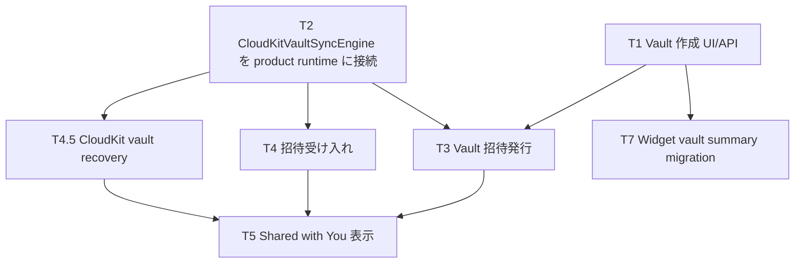

# Journal Vault Tasks

この document は Journal の vault / CloudKit collaboration 作業を進めるための
task board。設計の source of truth は `VAULT_SYNC_DESIGN.md`、現在仕様の
source of truth は `SPECIFICATION.md`。この file は PM / coordinator が更新し、
subagent worker は基本的に自分の担当 file を変更して結果を報告する。

## 運用ルール

- 実装前に coordinator が task をここへ追加し、依存関係と担当範囲を決める。
- subagent に渡す task は、触ってよい module / file ownership を明示する。
- 並行実装では同じ file を複数 worker に触らせない。衝突しそうな task は順序化する。
- Apple API の仕様確認は `sosumi` を first source とする。使えない場合だけ SDK symbols、
  sample code、web fallback を使う。
- 実装済み、product 起動に wire 済み、docs に記載済み、の 3 つを分けて記録する。
- worker 完了後、coordinator が review、統合、docs 更新、build / test 確認を行う。

## 状態

- `Todo` — まだ着手しない。
- `Ready` — 依存が解けていて worker に渡せる。
- `In Progress` — 実装中。
- `Review` — worker 完了、coordinator review 待ち。
- `Blocked` — 外部条件または設計判断待ち。
- `Done` — build / test / docs まで確認済み。

## 依存関係



## Current Board

### T0. Legacy migration path removal

- 状態: `Done`
- 目的: pre-release schema として migration path を持たない方針に整理する。
- 結論:
  - 旧 local SwiftData SQLite migration は product path から外した。
  - `JournalModel` / `JournalStore` module は product project から削除した。
  - CloudKit-only legacy migration task は削除した。
  - 現在 product startup に migration は wire されていない。
- 確認箇所:
  - `Sources/Journal/TinycurveApp.swift`
  - `Sources/Journal/App/JournalVaultRuntime.swift`
  - `docs/VAULT_SYNC_DESIGN.md`

### T1. Vault 作成/削除 UI/API

- 状態: `Done`
- 目的: 初期 catalog が空の新規 user でも、user が自分で vault を作れるようにする。
- 依存: なし。
- 担当範囲:
  - `Sources/Journal/App/JournalVaultRuntime.swift`
  - `Sources/Journal/Features/Vaults/`
  - 必要なら `Sources/JournalVault/Catalog/VaultCatalogStore.swift`
- 実装方針:
  - `JournalVaultRuntime.createVault(title:)` を追加する。
  - 既存の `VaultCatalogStore.createVault(title:using:)` を使う。
  - 作成後に catalog を reload し、必要なら作成した vault を選択する。
  - `VaultSelectionView` に作成 UI を追加する。
  - `VaultSelectionView` の row swipe/context menu から削除 confirmation を出す。
  - 削除は `VaultSyncEngine.deleteVault(_:)` で CloudKit zone を消してから、
    catalog row と vault-local content directory を削除する。
- Done:
  - preset vault を自動作成せず、vault picker から新規 vault を作成できる。
  - 作成した vault を選択して `CreationView` へ入れる。
  - vault picker から owned/participant vault を削除できる。
  - `Tinycurve` scheme の simulator build が通る。
- Verification:
  - 2026-07-04: `Journal` simulator build succeeded on `iPhone 17`.

### T2. CloudKitVaultSyncEngine を product runtime に接続

- 状態: `Done`
- 目的: share / invite の前提として、実 CloudKit transport を product
  runtime で使えるようにする。
- 依存: なし。ただし runtime behavior の検証が必要。
- 担当範囲:
  - `Sources/Journal/App/JournalVaultRuntime.swift`
  - `Sources/JournalVault/Sync/`
  - `Sources/Journal/Features/Settings/` の debug 表示
- 実装方針:
  - `appGroupLoggingRuntime()` を production 用 runtime と debug stub 用 runtime に分ける。
  - app runtime は `CloudKitVaultSyncEngine` を使う。
  - preview / tests は `LoggingVaultSyncEngine` を維持する。
- Risk:
  - iCloud account / simulator / schema 未作成時の failure 表示。
  - CKSyncEngine state file と App Group layout の初回作成。
- Coordinator note:
  - `CloudKitVaultSyncEngine` の initializer は throw しない。root directory 作成失敗は
    `start()` 内で log して sync disabled にできるため、product runtime へ接続しても
    app startup 自体は fatal にしない設計にできる。
  - `SettingsView` の debug footer は logging stub 前提の文言なので、T2 実装時に
    CloudKit transport / stub のどちらでも読める表現へ変える。
- Done:
  - local write の pending mutation が CloudKit engine に渡る。
  - CloudKit unavailable 時に app 起動が fatal にならない。
  - simulator build が通る。
- Verification:
  - 2026-07-04: `Journal` simulator build succeeded on `iPhone 17`.
  - Live CloudKit account/network behavior is not yet manually verified.

### T3. Vault 招待発行

- 状態: `Done`
- 目的: owned vault を zone-wide share として招待できるようにする。
- 依存:
  - T1 Vault 作成 UI/API
  - T2 CloudKit runtime 接続
- 担当範囲:
  - `Sources/JournalVault/Sync/CloudKitVaultSyncEngine.swift`
  - `Sources/JournalVault/Catalog/VaultCatalogStore.swift`
  - `Sources/Journal/Features/Vaults/`
  - `Sources/Journal/Features/Sharing/`
- 実装方針:
  - sync layer に `prepareShare(for vaultID:)` command を追加する。
  - vault zone を CloudKit に確保し、pending outbox を一度 `CKSyncEngine` へ流す。
  - 既存 zone-wide share を `CKRecordNameZoneWideShare` で fetch し、なければ
    `CKShare(recordZoneID:)` を作って保存する。
  - saved share の `shareURL` / record name / participant count を `VaultSummary` に保存する。
  - 保存済み share を `NSItemProvider.registerCKShare(...)` に登録し、iOS activity と
    native macOS sharing picker の collaboration entry を採用する。
  - sharing UI は初期範囲として private invite / read-write permission に絞る。
- API notes:
  - `sosumi` / Apple docs: `CKShare(recordZoneID:)` は iOS 15+ の zone-wide share
    initializer。custom record zone は既定で `zoneWideSharing` capability を持つ。
  - system collaboration entry は previously saved `CKShare` を受け取る。sync layer で
    share を保存してから item provider に登録し、UI layer が新たな CloudKit save をしない。
  - zone-wide share を accept した participant 側では、CloudKit が shared database に
    new zone を追加する。fetch database changes で zone ID を得てから record zone changes を
    fetch する、という流れは現在の `CloudKitVaultSyncEngine` の shared database import 方針と合う。
- Risk:
  - `CKShare` 作成には zone の存在が必要。
  - owner でない vault では invite UI を出さない。
  - Shared with You 連携は T5 に分離する。
- Done:
  - owned vault から system sharing UI を開ける。
  - share preparation 後に `VaultSummary.isShared` / `participantCount` が更新される。
- Verification:
  - 2026-07-04: Xcode MCP `BuildProject` succeeded for MuApps workspace (`windowtab2`).
  - Build log still contains pre-existing warnings unrelated to vault sharing
    (framework umbrella headers, missing AccentColor, navigation bar cast).
  - Live CloudKit account/network invite delivery is not yet manually verified.

### T4. 招待受け入れ

- 状態: `Done`
- 目的: 他 user からの vault share を accept し、vault picker に participant vault として出す。
- 依存:
  - T2 CloudKit runtime 接続
  - T3 の share 発行で実機検証可能な invite が作れること
- 担当範囲:
  - app / scene open URL handling
  - `Sources/Journal/App/JournalVaultRuntime.swift`
  - `Sources/JournalVault/Sync/CloudKitVaultSyncEngine.swift`
  - `Sources/JournalVault/Catalog/VaultCatalogStore.swift`
- 実装方針:
  - `CKShare.Metadata` の受け取り口を作る。
  - SwiftUI app では UIKit scene delegate を追加し、既存 scene callback と
    cold-launch `UIScene.ConnectionOptions.cloudKitShareMetadata` の両方を処理する。
  - `CKContainer.accept(_:)` / `CKAcceptSharesOperation` で accept する。
  - accept 後に shared database changes / record zone changes を fetch し、
    fetched zone を `VaultCatalogStore.materializeRemoteVault` で materialize する。
  - 初回 import 後に vault picker に表示する。
- API notes:
  - `sosumi` / Apple docs: `UIWindowSceneDelegate.windowScene(_:userDidAcceptCloudKitShareWith:)`
    は CloudKit share invitation への応答口。app が未起動の場合は
    `UIScene.ConnectionOptions.cloudKitShareMetadata` に metadata が入る。
  - `CKContainer.accept(_:)` は iOS 15+ の async API で、`CKShare.Metadata` を accept して
    accepted `CKShare` を返す。
- Risk:
  - shared database subscription / fetch の timing。
  - accept 成功後、shared database の new zone が即時 fetch できない場合の retry / refresh。
- Done:
  - `TinycurveAppDelegate` / `TinycurveSceneDelegate` route both running-scene and
    cold-launch `CKShare.Metadata` into SwiftUI through
    `CloudKitShareAcceptanceRouter`.
  - `JournalVaultRuntime.acceptShare(metadata:)` delegates acceptance to
    `VaultSyncEngine`, starts the runtime if needed, refreshes the catalog, and
    updates the selected vault descriptor after import.
  - `CloudKitVaultSyncEngine` accepts `CKShare.Metadata`, kicks the shared
    `CKSyncEngine` with an all-scope fetch prioritized for the accepted zone,
    and uses the existing shared-zone materialization/import handlers.
  - `LoggingVaultSyncEngine` reports invite acceptance as unsupported.
  - acceptance success / failure is surfaced through app-wide notifications.
- Verification:
  - 2026-07-04: Xcode MCP `BuildProject` succeeded for MuApps workspace (`windowtab2`).
  - Build log still contains pre-existing warnings unrelated to invite
    acceptance (empty Numerics shim library, missing AccentColor, navigation bar
    cast).
  - Live two-account CloudKit invite acceptance is not yet manually verified.

### T4.5. CloudKit vault recovery

- 状態: `Ready`
- 目的: app reinstall / local catalog loss / partial startup failure の後でも、iCloud 上に残る
  owned vault と accepted shared vault を local catalog に復元する。
- 依存:
  - T2 CloudKit runtime 接続
  - T3 Vault 招待発行
  - T4 招待受け入れ
- 担当範囲:
  - `Sources/Journal/App/JournalVaultRuntime.swift`
  - `Sources/JournalVault/Sync/CloudKitVaultSyncEngine.swift`
  - `Sources/JournalVault/Catalog/VaultCatalogStore.swift`
  - `Sources/Journal/Features/Settings/` の debug / smoke-test 表示
- 実装方針:
  - 起動時に毎回 lightweight recovery / reconciliation を kick する。
  - local catalog が空かどうかに関係なく、private database と shared database の
    Journal vault zones を enumerate し、missing catalog rows を materialize する。
  - `privateCloudDatabase` の custom zones は owned vault として復元する。
  - `sharedCloudDatabase` の accepted zones は participant vault として復元し、
    `zoneOwnerName` を保持する。
  - zone 名または `VaultInfo` record で Journal vault だけに絞る。
  - zone-wide share は `CKRecordZone.share` または `CKRecordNameZoneWideShare` fetch で
    再発見し、`VaultSummary.isShared` / `shareURL` / participant state を補正する。
  - recovery は UI を block しない。iCloud account unavailable / network failure は
    non-fatal に記録し、次回起動または手動 refresh で再試行する。
  - full record / CKAsset import を毎回やり直さない。missing vault materialization と
    `CKSyncEngine.fetchChanges(.all)` の kick に留め、asset download は通常 sync path に任せる。
  - recovery 後も local / remote vault が 0 件なら、onboarding 未完了では
    new user onboarding、完了済みでは空の vault picker を表示する。
    preset vault は自動作成しない。
  - Root routing は fresh install のみ blocking Loading とする。
    `hasResolvedInitialVaultAvailability` がある launch では cached route を即表示し、
    vault runtime / background sync は毎回走らせる。
  - iCloud available では初回 vault discovery を待つ。blocking 範囲は Journal vault zone と
    `VaultInfo` title record までに限定し、card/media import と `CKAsset` download は
    resolved 後の background sync に任せる。iCloud no account / restricted では
    local-only state として解決し、iCloud を使っていない user を Loading に閉じ込めない。
  - temporarily unavailable / network failure / account status could not determine では
    deferred CloudKit recovery として解決し、次回以降の background sync に任せる。
  - deferred CloudKit recovery 中は vault picker に compact banner を出し、
    Settings の Debug-only `Vault Runtime` で last availability resolution を確認できる。
- Risk:
  - `JournalVaultRuntime.start()` の起動順を変える必要がある。
  - zone enumeration が多い account でも起動 UX を重くしないこと。
- Done:
  - app reinstall 後、accepted shared vault と owned vault が picker に復元される。
  - local catalog が一部欠けても、次回起動で missing vault が復元される。
  - recovery status / last error が Debug UI で見える。
  - live CloudKit で private + shared vault recovery を smoke test できる。

### T5. Shared with You 表示

- 状態: `In Progress`
- 目的: Messages / share sheet で collaboration preview を出し、app 内で `SWCollaborationView`
  を表示する。
- 依存:
  - T3 Vault 招待発行
  - T4 招待受け入れ
- 担当範囲:
  - `Sources/Journal/Features/Vaults/`
  - `Sources/Journal/Features/Sharing/`
  - `Sources/JournalVault/Catalog/VaultSummary.swift`
- 実装方針:
  - `CKShare` を `NSItemProvider` / transfer representation に載せる。
  - share preview title / image は `VaultSummary` から作る。
  - 初期 surface として vault picker の owned vault cell に明示的な share button を置き、
    catalog 上 shared な owned vault には `SWCollaborationView` も並べて置く。
    selected-vault composer toolbar にも shared な owned vault の `SWCollaborationView`
    を表示する。
    `SWCollaborationView` は share 状態の visual affordance と管理入口として扱い、
    cell 表示時には CloudKit transport を走らせない。
  - share button は `VaultCollaborationSharePresentation` の saved-CKShare activity 導線を
    使い、Notes のように collaboration state 表示とは別の invite affordance として残す。
  - 必要なら後続で shared vault settings にも `SWCollaborationView` を置く。
- Done:
  - Messages に vault preview が出る。
  - vault picker cell と composer toolbar で app 内の collaboration state を見られる。

### T7. Widget vault summary optimization

- 状態: `Todo`
- 目的: widget が現在の selected vault store 直接読みに加えて、
  `VaultCatalogStore` / `VaultSummary` から latest preview を読めるようにする。
- 依存:
  - T1 Vault 作成 UI/API
  - vault summary の latest card denormalize 方針
- 担当範囲:
  - `Sources/JournalWidget/`
  - `Sources/JournalVault/Catalog/`
  - `Sources/JournalVault/Content/` の write path
- Done:
  - widget が vault summary から latest card preview を出す。
  - removed `JournalModel` module を戻さずに済む。

## Subagent Assignment Template

```text
Task: Tn. <title>
Role: worker / explorer
Mode: edit / read-only
Ownership: <files or modules>
Do not touch: <files or modules>
Context:
- <design constraints>
- <dependency notes>
Deliverables:
- changed files
- verification command/result
- open questions
```
